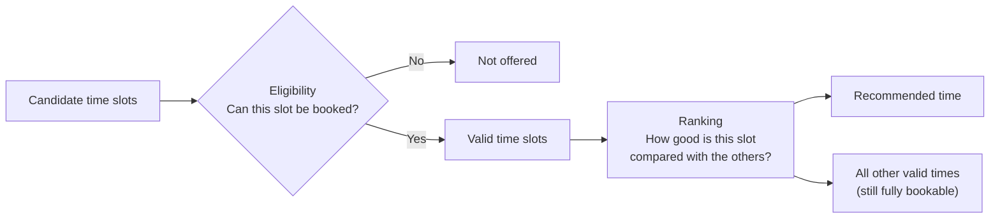

# Timbra — QA & Product Case Study

**Timbra is a smart booking platform for the salon industry that I created from the ground up as a real-world product and QA project.** It recommends the booking times that keep a salon's calendar efficient, while every other valid time stays fully bookable.

I'm **Adriana Bucur**, a QA / Software Tester. I defined Timbra's product concept, requirements, business rules and booking logic, and directed the project from the first idea through implementation, testing and validation. This portfolio documents the QA side of that work:

**Requirement → Risk → Test Scenario → Test Case → Test Execution → Evidence → Regression Protection**

> **About this repository**
> - **Documentation-only portfolio.** The application source code is **private** and isn't included here.
> - **AI-assisted implementation:** the application code was generated with an AI coding assistant under my direction and review. My contribution is the product, quality and validation work documented in this portfolio. [More about my role](docs/about/my-role-and-ai-assisted-development.md).
> - All names, data and examples are sanitized or illustrative. No customer data, credentials or infrastructure details are published.

**Start here:** [Magnetic Booking](docs/product/magnetic-booking.md) → [Traceability examples](docs/qa/traceability-examples.md) → [Regression case studies](docs/qa/regression-case-studies.md)

---

## At a glance

| | |
|---|---|
| **Product** | Online booking for a salon: customers book treatments; the salon owner manages treatments, working hours and bookings |
| **What's interesting** | "Magnetic Booking": valid times are *ranked* so the calendar keeps fewer unusable gaps, without hiding any valid choice |
| **My role** | Product creator and QA owner: concept, requirements, business rules, QA strategy, risk analysis, test design and execution, regression analysis, validation |
| **QA evidence** | [25 selected test cases](docs/qa/test-cases/README.md) · [Traceability examples](docs/qa/traceability-examples.md) · [5 regression case studies](docs/qa/regression-case-studies.md) · [Risk register](docs/qa/risk-register.md) |
| **Testing** | 500+ automated tests (unit, domain logic, real-database integration, security guards) plus manual functional, visual and responsive testing |
| **Stack (high level)** | Next.js · TypeScript · PostgreSQL (Supabase) · Vitest · Docker · Vercel · Git / GitHub |
| **Status** | Working V1 for one salon, still in development. Not a finished commercial SaaS product. |

## The problem

A salon's day isn't made of identical one-hour blocks. Treatments have different lengths, and each one also needs **preparation time** before it and **cleanup (buffer) time** after it. If bookings land in awkward places, the day fills up with small gaps that are too short to sell, and that time is lost.

At the same time, customers should keep **free choice**. A system that only offers a curated shortlist of times feels restrictive and loses their trust.

Timbra's answer: **work out every time that is genuinely bookable, then recommend the ones that fit the calendar best.**

**Why it's hard to test:** correctness depends on exact time boundaries, daylight-saving transitions, simultaneous booking requests, and a ranking algorithm that must never change which times are valid.

## How Timbra decides which times to offer



- **Eligibility** answers *"Can this time slot be booked?"* It checks working hours, schedule exceptions, existing bookings (including preparation and cleanup time), minimum notice and whether the time is in the past.
- **Ranking** answers *"How good is this valid slot compared with the other valid slots?"* It prefers times that leave fewer, larger free gaps.
- **Recommendation** is only a suggestion. **Ranking changes the order of the valid times, never whether a time is valid.**


*Magnetic Booking: all valid times remain bookable. Timbra recommends the slot that best preserves an efficient calendar.*

A valid time isn't automatically the recommended one. Here 09:05 is the earliest valid time, but 13:05 is recommended because it leaves a larger usable free block. 09:05 stays fully bookable.


*Occupied interval: availability and collision checks include preparation + treatment + buffer, not only the customer-visible appointment.*
<sub>The admin area is in Swedish: Förberedelse = preparation · Bokad = booked · Bekräftad = confirmed · Buffert / städning = buffer / cleanup. All data shown is fictional demo data.</sub>

Full explanation with a worked example: **[Magnetic Booking](docs/product/magnetic-booking.md)**

## What I did as QA

- **Risk-based strategy.** I identified the failures that would hurt the business most (double bookings, wrong times around daylight-saving changes, unauthorized admin access, secret leakage) and put the deepest test coverage there. See the [Test Strategy](docs/qa/test-strategy.md) and [Risk Register](docs/qa/risk-register.md).
- **Traceability.** Requirements are linked to risks, scenarios, test cases and evidence. **See one complete QA chain:** [Traceability Example 2](docs/qa/traceability-examples.md#example-2-the-admin-can-skip-minimum-notice-but-never-book-the-past) → [ADM-007](docs/qa/test-cases/booking-engine.md#adm-007-the-admin-still-cannot-book-a-past-time) → [Regression case study 2](docs/qa/regression-case-studies.md#case-study-2--admin-notice-bypass-also-bypassed-the-past-time-safety-floor).
- **Test execution.** I ran the automated suite and investigated and classified test failures. I performed manual functional, visual and responsive testing of the customer and admin flows, plus post-deployment smoke checks.
- **Positive, negative and boundary testing.** This includes exact-instant boundaries such as cancellation cutoffs, minimum notice, back-to-back bookings and daylight-saving transitions. See [Boundary & negative testing](docs/qa/boundary-and-negative-testing.md).
- **Two layers of protection against double booking.** The application re-checks availability before saving, and the database independently rejects overlapping bookings. I designed tests for both layers, including two booking requests arriving at the same moment, and validated the results.
- **Regression investigation.** For real defects I found the root cause, made sure a regression test was added, and recorded the lesson. See [Regression case studies](docs/qa/regression-case-studies.md).
- **Known gaps.** I documented what isn't covered yet, such as browser end-to-end automation and a CI gate, as planned next steps. See [Known limitations & future QA](docs/qa/known-limitations-and-future-qa.md).

## Where to look

| Topic | Documents |
|---|---|
| **Product** | [Product overview](docs/product/product-overview.md) · [Magnetic Booking](docs/product/magnetic-booking.md) · [Booking flow](docs/product/booking-flow.md) · [Architecture overview](docs/product/architecture-overview.md) |
| **QA approach** | [Test Strategy](docs/qa/test-strategy.md) · [Test Plan](docs/qa/test-plan.md) · [Test types & approach](docs/qa/test-types-and-approach.md) · [Boundary & negative testing](docs/qa/boundary-and-negative-testing.md) |
| **QA evidence** | [Test cases](docs/qa/test-cases/README.md) · [Risk Register](docs/qa/risk-register.md) · [Traceability examples](docs/qa/traceability-examples.md) · [Regression case studies](docs/qa/regression-case-studies.md) |
| **Next steps** | [Known limitations & future QA](docs/qa/known-limitations-and-future-qa.md) · [Planned stakeholder usability session](docs/qa/stakeholder-usability-session.md) |
| **About me** | [My role & AI-assisted development](docs/about/my-role-and-ai-assisted-development.md) · [Lessons learned](docs/about/lessons-learned.md) |

## Current limitations (summary)

- No browser end-to-end automation yet. Manual testing currently covers the full user journeys.
- No CI test gate before deployment yet.
- No dedicated staging environment yet.
- Real email/SMS delivery isn't production-ready yet. The notification *pipeline* is tested, but real delivery isn't.
- Test-data isolation between local demo data and integration tests is an identified improvement area.

These are the next engineering and QA maturity steps, described in detail in [Known limitations & future QA](docs/qa/known-limitations-and-future-qa.md).

## Repository structure

```
docs/product/   what Timbra is and how booking works
docs/qa/        strategy, plan, test cases, risks, traceability, regressions
docs/about/     my role, AI-assisted development, lessons learned
assets/         reviewed screenshots from local demo data
```

---

**Adriana Bucur**, QA / Software Tester · © Adriana Bucur. All rights reserved. This portfolio documentation is shared for viewing only. No license is granted to copy, modify or redistribute it.
