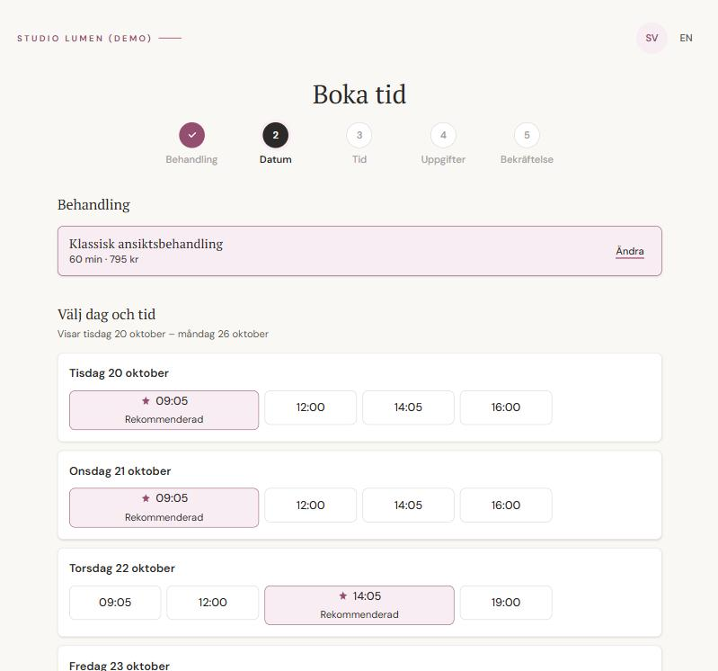

# Timbra — QA & Product Case Study

**Timbra is a booking platform for salons that I created as a real product and QA project.** It offers online customers only the times that keep the salon's calendar compact ("Magnetic Booking"), while the salon owner can still book any valid time.

**Status (7 October 2026):** a V2 pilot for one salon. Release **v2.1.0** has been live in production and in the public demo since 6 October 2026. Validation by the salon owner is still pending. Not a finished commercial product.

**▶ Demo (fictional data):** [Customer booking](https://timbra-booking-demo.vercel.app/sv/booking) · [Admin, read-only](https://timbra-booking-demo.vercel.app/admin)

## My contribution

I'm **Adriana Bucur**, a QA / Software Tester. I defined the product concept, requirements and business rules, and I own quality: QA strategy, risk analysis, test design, manual testing, validation and regression analysis.

An AI coding assistant helps with the application code, the automated test code, documentation drafts and running checks. I direct the work, review what it produces, do the manual testing and make the product decisions. More in [My role & AI-assisted development](docs/about/my-role-and-ai-assisted-development.md).

This repository is documentation only; the application source code is private.

## From V1 to V2

- **V1** ranked every valid time and recommended the best one, while customers could still pick any valid time.
- **Salon owner feedback (September 2026):** showing every free minute lets short treatments split long free periods into gaps that can't be sold. Free periods should fill from their edges inward.
- **V2 (production since 30 September 2026):** *technically available ≠ offered.* Online customers see only a few edge times; the salon owner keeps every valid time. On the same demo day, the public offer went from eight times plus "Show more" to two.
- **v2.1.0 (6 October 2026):** the day's earliest and latest start are always offered, times are listed in time order with the recommended one marked, and a daily 13:00–14:00 break was added.

Details, the before → after example and the verification: **[From V1 to V2](docs/product/evolution-v1-to-v2.md)**. How eligibility, the public offer and ranking work: **[Magnetic Booking](docs/product/magnetic-booking.md)**.

*Scrolled view of the public demo, captured 7 October 2026 (v2.1.0); the demo's fictional-data notice sits just above the visible area: offered times for a 60-minute treatment on days without bookings, split by the 13:00–14:00 break. Each free period offers only its earliest and latest start, and the recommended time is marked. More screenshots, including V1 and the first V2: [screenshot index](assets/screenshots/README.md).*

## QA evidence

| | |
|---|---|
| **Automated tests** | **1,118 tests passed on 6 October 2026** for release v2.1.0: unit, domain logic, security guards and real-database integration tests, on an isolated, throwaway test database. Earlier: 654 unit and domain-logic tests on 29 September 2026 (first V2). Recorded results; not re-run for this page. |
| **Test design** | [33 selected test cases](docs/qa/test-cases/README.md) with positive, negative, boundary and concurrency cases, linked to a [risk register](docs/qa/risk-register.md) |
| **Defects and regressions** | [5 regression case studies](docs/qa/regression-case-studies.md): root cause, fix and the regression test that now guards it |
| **Manual testing** | Functional, visual and responsive checks of the customer and admin flows; read-only checks of the demo and production after each deployment |
| **Release practice** | Tested release candidate on the demo first, then production; [release v2.1.0 verification](docs/product/evolution-v1-to-v2.md#release-v210-6-october-2026) |

## Reading path (about 15 minutes)

1. [From V1 to V2](docs/product/evolution-v1-to-v2.md): feedback, decision, before → after, verification
2. [Magnetic Booking](docs/product/magnetic-booking.md): eligibility, the public offer and ranking
3. One complete QA chain: [traceability example 2](docs/qa/traceability-examples.md#example-2-the-admin-can-skip-minimum-notice-but-never-book-the-past) → [test case ADM-007](docs/qa/test-cases/booking-engine.md#adm-007-the-admin-still-cannot-book-a-past-time) → [regression case study 2](docs/qa/regression-case-studies.md#case-study-2--admin-notice-bypass-also-bypassed-the-past-time-safety-floor)
4. [Test Strategy](docs/qa/test-strategy.md) and [Boundary & negative testing](docs/qa/boundary-and-negative-testing.md)
5. [Known limitations & future QA](docs/qa/known-limitations-and-future-qa.md)

## Limitations

- No browser end-to-end automation, CI test gate or staging environment yet.
- No screen-reader, cross-browser or performance testing yet.
- Real email/SMS delivery isn't production-ready; the notification pipeline is tested, delivery isn't.
- Salon-owner validation of V2 is pending, and two minor known issues in v2.1.0 have fixes in review that are not released.

Details: [Known limitations & future QA](docs/qa/known-limitations-and-future-qa.md).

---

**Adriana Bucur**, QA / Software Tester · © Adriana Bucur. All rights reserved. This portfolio documentation is shared for viewing only. No license is granted to copy, modify or redistribute it.
