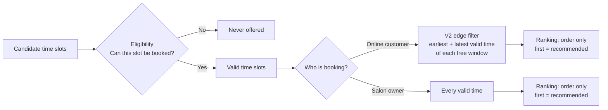
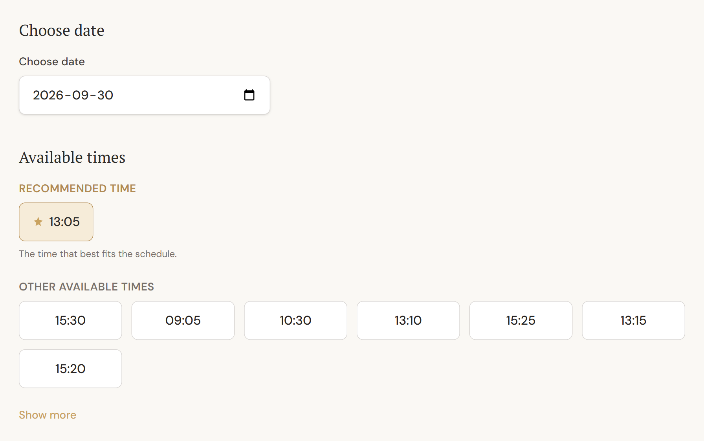
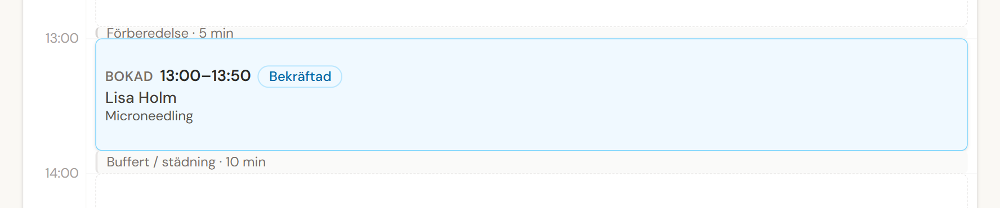

# Timbra — QA & Product Case Study

**Timbra is a smart booking platform for the salon industry that I created from the ground up as a real-world product and QA project.** Online customers are offered only the booking times that keep a salon's calendar compact, while the salon owner can still book any valid time.

### ▶ [Try Timbra Demo](https://timbra-booking-demo.vercel.app)

**Customer Booking**: explore the public booking flow  
[Open Customer Booking](https://timbra-booking-demo.vercel.app/sv/booking)

**Admin Demo (read-only)**: explore bookings, preparation time and calendar views  
[Open Admin Demo](https://timbra-booking-demo.vercel.app/admin)

A development/pilot demo with fictional data, not a production commercial system.

*The live demo shows the current V2 pilot rules; the case study below documents the earlier V1 implementation and evolution.*

I'm **Adriana Bucur**, a QA / Software Tester. I defined Timbra's product concept, requirements, business rules and booking logic, and directed the project from the first idea through implementation, testing and validation. This portfolio documents the QA side of that work:

**Requirement → Risk → Test Scenario → Test Case → Test Execution → Evidence → Regression Protection**

> **About this repository**
> - **Documentation-only portfolio.** The application source code is **private** and isn't included here.
> - **AI-assisted implementation:** the application code was generated with an AI coding assistant under my direction and review. My contribution is the product, quality and validation work documented in this portfolio. [More about my role](docs/about/my-role-and-ai-assisted-development.md).
> - All names, data and examples are sanitized or illustrative. No customer data, credentials or infrastructure details are published.

**Start here:** [From V1 to V2](docs/product/evolution-v1-to-v2.md) → [Magnetic Booking](docs/product/magnetic-booking.md) → [Traceability examples](docs/qa/traceability-examples.md) → [Regression case studies](docs/qa/regression-case-studies.md)

---

## At a glance

| | |
|---|---|
| **Product** | Online booking for a salon: customers book treatments; the salon owner manages treatments, working hours and bookings |
| **Live demo** | [Customer Booking](https://timbra-booking-demo.vercel.app/sv/booking) · [Admin Demo (read-only)](https://timbra-booking-demo.vercel.app/admin), with fictional data |
| **What's interesting** | "Magnetic Booking": each free window shows only its edge times, which move inward as bookings are made, helping reduce unusable gaps |
| **My role** | Product creator and QA owner: concept, requirements, business rules, QA strategy, risk analysis, test design and execution, regression analysis, validation |
| **QA evidence** | [29 selected test cases](docs/qa/test-cases/README.md) · [Traceability examples](docs/qa/traceability-examples.md) · [5 regression case studies](docs/qa/regression-case-studies.md) · [Risk register](docs/qa/risk-register.md) |
| **Testing** | 654 automated unit and domain-logic tests (including security guards), plus real-database integration tests and manual functional, visual and responsive testing |
| **Stack (high level)** | Next.js · TypeScript · PostgreSQL (Supabase) · Vitest · Docker · Vercel · Git / GitHub |
| **Status** | Working V2 pilot with a live demo for one salon, currently in development and stakeholder validation. Not a finished commercial SaaS product. |

## The problem

A salon's day isn't made of identical one-hour blocks. Treatments have different lengths, and some need **preparation time** before the customer arrives. If bookings land in awkward places, for example a short treatment in the middle of a long free period, the day fills up with small gaps that are too short to sell, and that time is lost.

Timbra V2's answer is **edge-only Magnetic Booking**: online customers are offered only the times at the edges of each free window, and those times move inward as bookings fill the day. The salon owner can still book any valid time.

**Why it's hard to test:** correctness depends on exact time boundaries, daylight-saving transitions, simultaneous booking requests, and a ranking algorithm that must never change which times are valid.

## From V1 to V2

| Step | What happened |
|---|---|
| **1. V1 idea** | Rank every valid time and recommend the best one, while the customer can still pick any valid time. |
| **2. Salon owner feedback** | Online booking should fill the remaining gaps, not expose every free minute. A short treatment in the middle of a long free period ruins it for longer treatments. Fill free periods from their edges inward. |
| **3. Product decision** | *Technically available ≠ offered.* Online customers see only the edge times of each free window; the salon owner keeps every valid time. Preparation 5 min, buffer 0, public booking window 2 calendar months. |
| **4. V2 behaviour** | A new edge filter between eligibility and ranking. On the same demo day, customers went from eight times plus "Show more" (V1) to **10:10** and **15:10** (V2), then **11:15** and **15:10** after one booking. |
| **5. Verification** | Automated tests (654 unit and domain-logic tests), a manual local walkthrough, and checks on the deployed demo. Validation of V2 by the salon owner is still planned. |

The full story, with the before → after example and the evidence: **[From V1 to V2](docs/product/evolution-v1-to-v2.md)**

## How Timbra decides which times to offer (V2)


```mermaid
flowchart LR
    A["Candidate time slots"] --> B{"Eligibility<br/>Can this slot be booked?"}
    B -- "No" --> X["Never offered"]
    B -- "Yes" --> C["Valid time slots"]
    C --> D{"Who is booking?"}
    D -- "Online customer" --> E["V2 edge filter<br/>earliest + latest valid time<br/>of each free window"]
    D -- "Salon owner" --> F["Every valid time"]
    E --> R1["Ranking: order only<br/>first = recommended"]
    F --> R2["Ranking: order only<br/>first = recommended"]
```

- **Eligibility** answers *"Can this time slot be booked?"* It checks working hours, schedule exceptions, existing bookings (including preparation), minimum notice and whether the time is in the past.
- **The V2 edge filter** answers *"Should an online customer be offered this eligible time?"* Only the earliest and latest valid time of each free window are offered, so bookings fill the day from both ends inward. The salon owner is not filtered.
- **Ranking** answers *"How good is this time compared with the others?"* It only **orders** the times it receives and never removes one; the first is marked as recommended.
- On submit, the server recalculates the offer for the same audience, so an online customer can't book an interior time by editing the request.

The V1 design (eligibility → ranking, with every valid time shown to the customer) is kept as history in [Magnetic Booking](docs/product/magnetic-booking.md#v1-design-history). The screenshots below are from V1.



*Historical V1 screenshot: every valid time stayed bookable, and 13:05 was recommended because it left a larger usable free block. In V2, online customers see only the edge times of each free window.*



*Historical V1 screenshot. Occupied interval: availability and collision checks include preparation + treatment + buffer, not only the customer-visible appointment. In the V2 pilot, the buffer is 0, so this booking would have no buffer segment.*
<sub>The admin area is in Swedish: Förberedelse = preparation · Bokad = booked · Bekräftad = confirmed · Buffert / städning = buffer / cleanup. All data shown is fictional demo data.</sub>

Full explanation with worked examples: **[Magnetic Booking](docs/product/magnetic-booking.md)**

## What I did as QA

- **Risk-based strategy.** I identified the failures that would hurt the business most (double bookings, wrong times around daylight-saving changes, unauthorized admin access, secret leakage) and put the deepest test coverage there. See the [Test Strategy](docs/qa/test-strategy.md) and [Risk Register](docs/qa/risk-register.md).
- **Traceability.** Requirements are linked to risks, scenarios, test cases and evidence. **See one complete QA chain:** [Traceability Example 2](docs/qa/traceability-examples.md#example-2-the-admin-can-skip-minimum-notice-but-never-book-the-past) → [ADM-007](docs/qa/test-cases/booking-engine.md#adm-007-the-admin-still-cannot-book-a-past-time) → [Regression case study 2](docs/qa/regression-case-studies.md#case-study-2--admin-notice-bypass-also-bypassed-the-past-time-safety-floor).
- **Test execution.** I ran the automated suite and investigated and classified test failures. I performed manual functional, visual and responsive testing of the customer and admin flows, plus post-deployment smoke checks.
- **Positive, negative and boundary testing.** This includes exact-instant boundaries such as cancellation cutoffs, minimum notice, back-to-back bookings and daylight-saving transitions. See [Boundary & negative testing](docs/qa/boundary-and-negative-testing.md).
- **Two layers of protection against double booking.** The application re-checks availability before saving, and the database independently rejects overlapping bookings. I designed tests for both layers, including two booking requests arriving at the same moment, and validated the results.
- **Regression investigation.** For real defects I found the root cause, made sure a regression test was added, and recorded the lesson. See [Regression case studies](docs/qa/regression-case-studies.md).
- **Known gaps.** I documented what isn't covered yet, such as browser end-to-end automation and a CI gate, as planned next steps. See [Known limitations & future QA](docs/qa/known-limitations-and-future-qa.md).

## Where to look

| Topic | Documents |
|---|---|
| **Product** | [From V1 to V2](docs/product/evolution-v1-to-v2.md) · [Product overview](docs/product/product-overview.md) · [Magnetic Booking](docs/product/magnetic-booking.md) · [Booking flow](docs/product/booking-flow.md) · [Architecture overview](docs/product/architecture-overview.md) |
| **QA approach** | [Test Strategy](docs/qa/test-strategy.md) · [Test Plan](docs/qa/test-plan.md) · [Test types & approach](docs/qa/test-types-and-approach.md) · [Boundary & negative testing](docs/qa/boundary-and-negative-testing.md) |
| **QA evidence** | [Test cases](docs/qa/test-cases/README.md) · [Risk Register](docs/qa/risk-register.md) · [Traceability examples](docs/qa/traceability-examples.md) · [Regression case studies](docs/qa/regression-case-studies.md) |
| **Next steps** | [Known limitations & future QA](docs/qa/known-limitations-and-future-qa.md) · [Planned stakeholder usability session](docs/qa/stakeholder-usability-session.md) |
| **About me** | [My role & AI-assisted development](docs/about/my-role-and-ai-assisted-development.md) · [Lessons learned](docs/about/lessons-learned.md) |

## Current limitations (summary)

- No browser end-to-end automation yet. Manual testing currently covers the full user journeys.
- No CI test gate before deployment yet.
- No dedicated staging environment yet.
- Real email/SMS delivery isn't production-ready yet. The notification *pipeline* is tested, but real delivery isn't.
- Test-data isolation between local demo data and integration tests is an identified improvement area.

These are the next engineering and QA maturity steps, described in detail in [Known limitations & future QA](docs/qa/known-limitations-and-future-qa.md).

## Repository structure

```
docs/product/   what Timbra is and how booking works
docs/qa/        strategy, plan, test cases, risks, traceability, regressions
docs/about/     my role, AI-assisted development, lessons learned
assets/         reviewed screenshots from local demo data
```

---

**Adriana Bucur**, QA / Software Tester · © Adriana Bucur. All rights reserved. This portfolio documentation is shared for viewing only. No license is granted to copy, modify or redistribute it.
