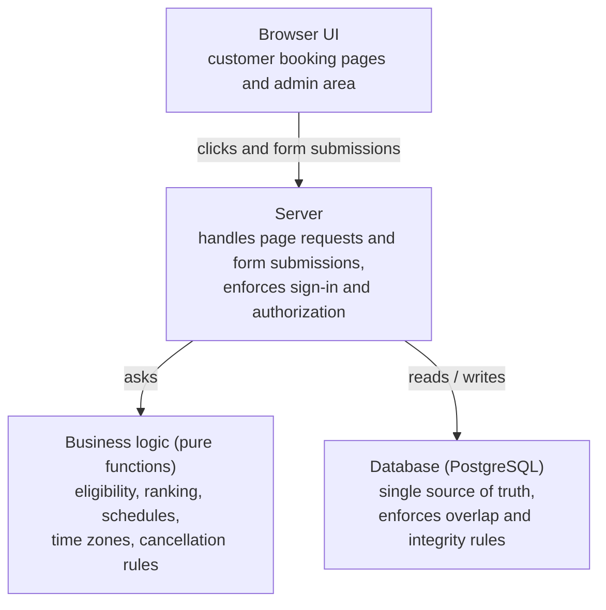

# Architecture Overview

This overview is deliberately high-level. It explains the structure that shaped the testing approach. It does not describe deployment, configuration or infrastructure details.

## Layers

| Layer | Responsibility | Why it matters for QA |
|---|---|---|
| **Browser UI** | Pages that customers and the salon owner see | Checked manually (functional, visual, responsive). No browser automation yet. |
| **Server** | Receives requests, re-validates everything, calls the logic and the database | The browser is **never trusted**: every booking is re-checked on the server just before it is saved |
| **Business logic** | Pure calculations with no database, network or hidden clock | Very fast, deterministic automated tests, including exact time boundaries |
| **Database** | Stores data and enforces the final rules | Tested against a **real** local database, because only a real database can prove its rules hold |

## Design principles that shaped testing

1. **Separate "what is allowed" from "what is recommended".** Eligibility and ranking are separate calculations, so a mistake in one can't silently break the other. This separation is tested directly.
2. **Defense in depth for critical rules.** Double booking is prevented both in the application and by the database itself.
3. **The server re-derives the truth.** Values the browser sends (treatment, date, time) are re-checked against the database before anything is written.
4. **Secrets stay on the server.** Automated source-scanning tests check that no secret-handling code can end up in code sent to the browser.
5. **Time is explicit.** Local salon time and absolute time are converted in one place, with daylight-saving edge cases rejected rather than guessed. The current time is passed in explicitly, which makes boundary tests possible.
6. **Customer-facing data is minimal.** Confirmation pages and messages show only what the customer needs. Checks that no internal identifiers or tokens appear are automated.

## Technology (high level)

| Area | Technology |
|---|---|
| Web application | Next.js (App Router), TypeScript |
| Styling | Tailwind CSS |
| Database and authentication | PostgreSQL via Supabase |
| Automated testing | Vitest |
| Hosting | Vercel |
| Local development | Docker-based local database |
| Version control | Git / GitHub |
| Languages | Swedish and English |

## Environments (conceptual)

| Environment | Used for |
|---|---|
| **Local** | Development, all automated tests (including real-database integration tests), and manual testing with demo data |
| **Production** | The live salon deployment. It gets manual smoke checks after deployment; production data is never reset or reseeded for testing. |
| **Staging** | *Not yet available.* Planned as a future improvement (see [limitations](../qa/known-limitations-and-future-qa.md)). |

## Related documents

- [Magnetic Booking](magnetic-booking.md)
- [Test Strategy](../qa/test-strategy.md)
- [Test types & approach](../qa/test-types-and-approach.md)
