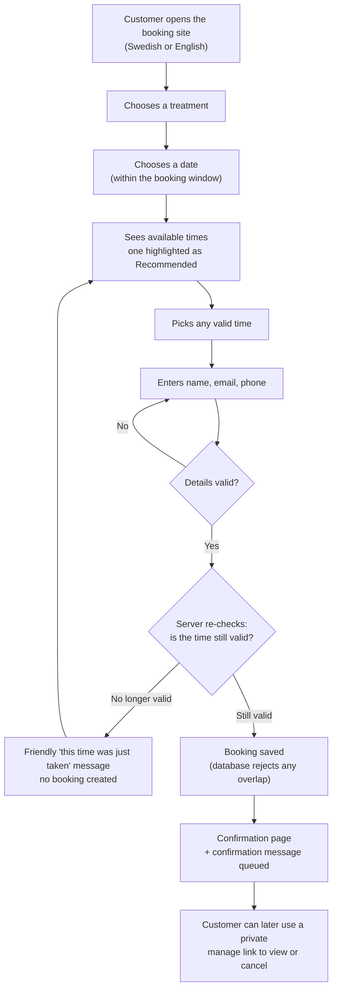
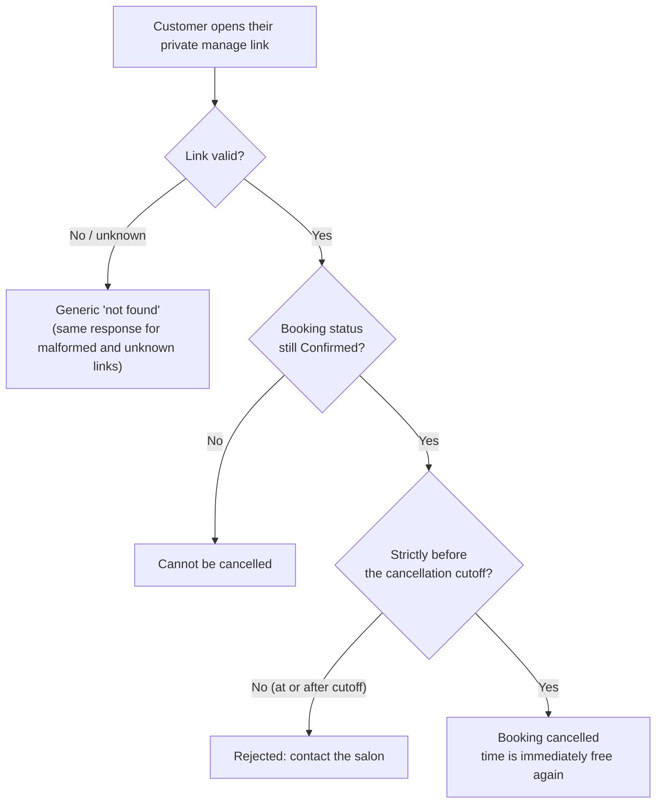
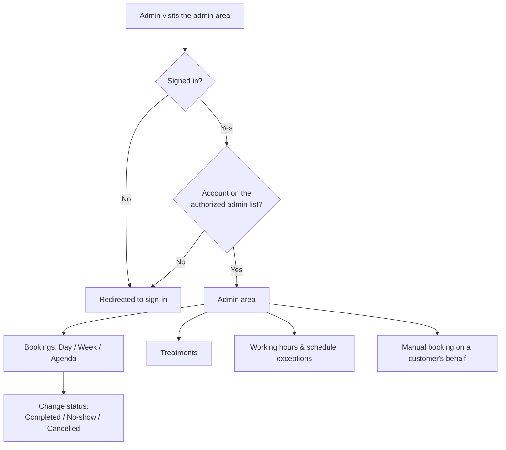
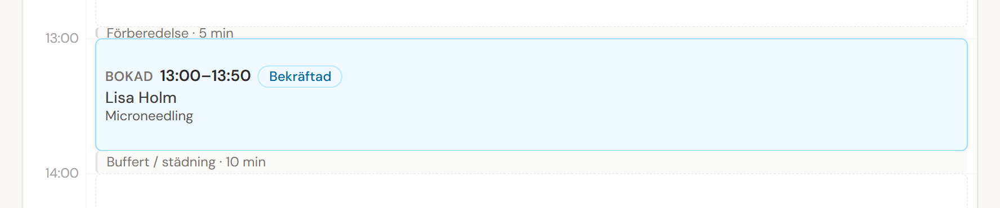
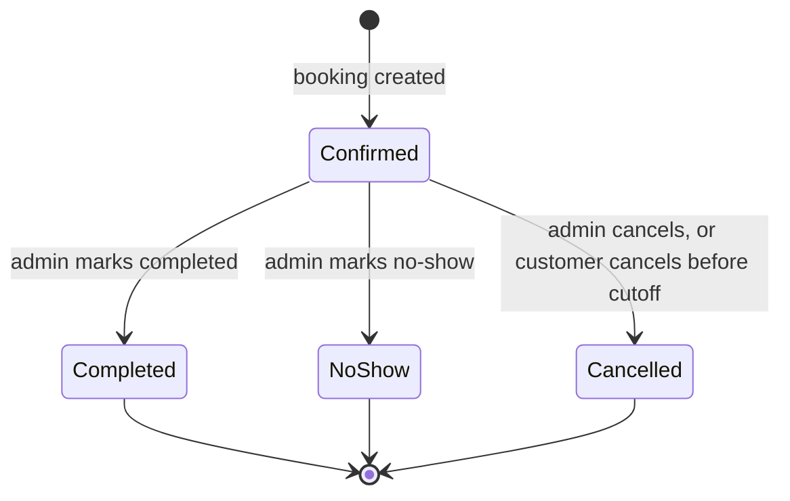

# Booking Flow

This page describes Timbra's main user flows at a high level: the customer journey, the admin journey and the booking lifecycle. Each diagram shows where testing focuses.

## 1. Customer booking journey

**Where QA focuses:**

| Step | Main risks | How it's tested |
|---|---|---|
| Available times | Offering an invalid time; hiding a valid one | Automated unit and domain-logic tests of eligibility and ranking |
| Recommended time | Recommendation hiding the other options | Automated test that all valid times stay present; manual check in the browser |
| Customer details | Bad data accepted, or good data rejected | Automated validation tests with valid and invalid inputs |
| Server re-check | A stale time gets booked | Automated recalculation tests; database-level overlap tests |
| Saving the booking | Double booking under simultaneous requests | Automated real-database concurrency test |
| Confirmation page | Showing more data than necessary | Automated check that only a fixed summary is shown (no tokens, email or phone) |
| Whole journey in a browser | Something breaks between the steps | **Manual** end-to-end testing. No browser automation yet (see [limitations](../qa/known-limitations-and-future-qa.md)). |

## 2. Customer self-cancellation

The cutoff check is a classic **boundary** test. With a 24-hour cutoff and an appointment at 15:00:

| When the customer tries to cancel | Result |
|---|---|
| Previous day, 14:59 | Allowed |
| Previous day, **exactly 15:00** | **Rejected** (the boundary itself is not allowed) |
| Previous day, 16:00 | Rejected |

## 3. Admin journey

**Customer bookings vs admin manual bookings.** Both use the same availability engine and the same database protection. The differences are deliberate and tested:

| Rule | Customer booking | Admin manual booking |
|---|---|---|
| Working hours and schedule exceptions | Enforced | Enforced |
| Overlap with existing bookings | Enforced | Enforced |
| Preparation / treatment / buffer maths | Same | Same |
| **Minimum notice (lead time)** | Enforced | **Skipped**, because the owner is booking a customer they are already talking to |
| **Past times** | Never bookable | **Never bookable** (the admin exception covers notice only) |
| Customer notifications | Created | **Not created** |

**What the admin sees:** the Day view shows each booking's full occupied time, meaning preparation, the appointment itself and buffer. This is the same interval the availability and collision rules use.

*Occupied interval: availability and collision checks include preparation + treatment + buffer, not only the customer-visible appointment.* Swedish labels: Förberedelse = preparation · Bokad = booked · Buffert / städning = buffer / cleanup. Fictional demo data.

## 4. Booking lifecycle

- **Confirmed** is the only status that can change.
- **Completed**, **No-show** and **Cancelled** are final. Undoing them was deliberately left out of V1.
- A **cancelled** booking stops blocking the calendar at once, so the time can be booked again.
- If a customer cancels at the same moment the admin changes the status, the database resolves it cleanly and only one change wins. This is covered by an automated concurrency test.

## Related documents

- [Magnetic Booking](magnetic-booking.md)
- [Architecture overview](architecture-overview.md)
- [Test cases](../qa/test-cases/README.md)
