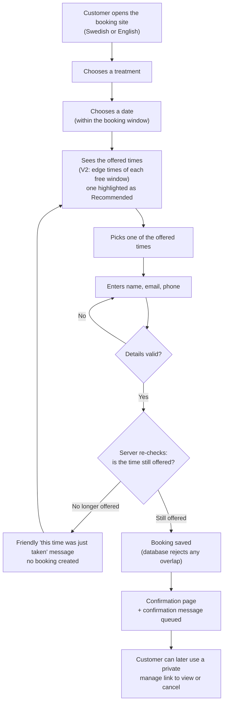
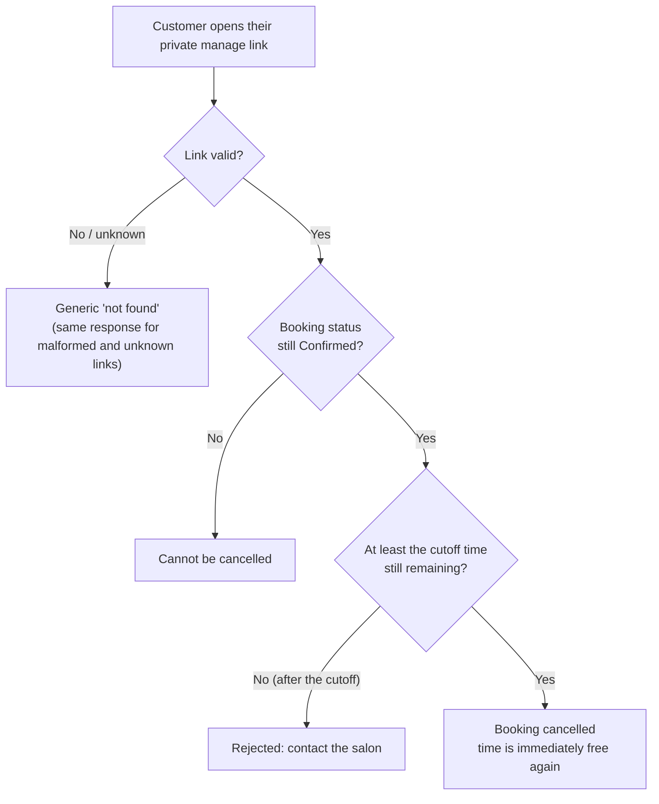
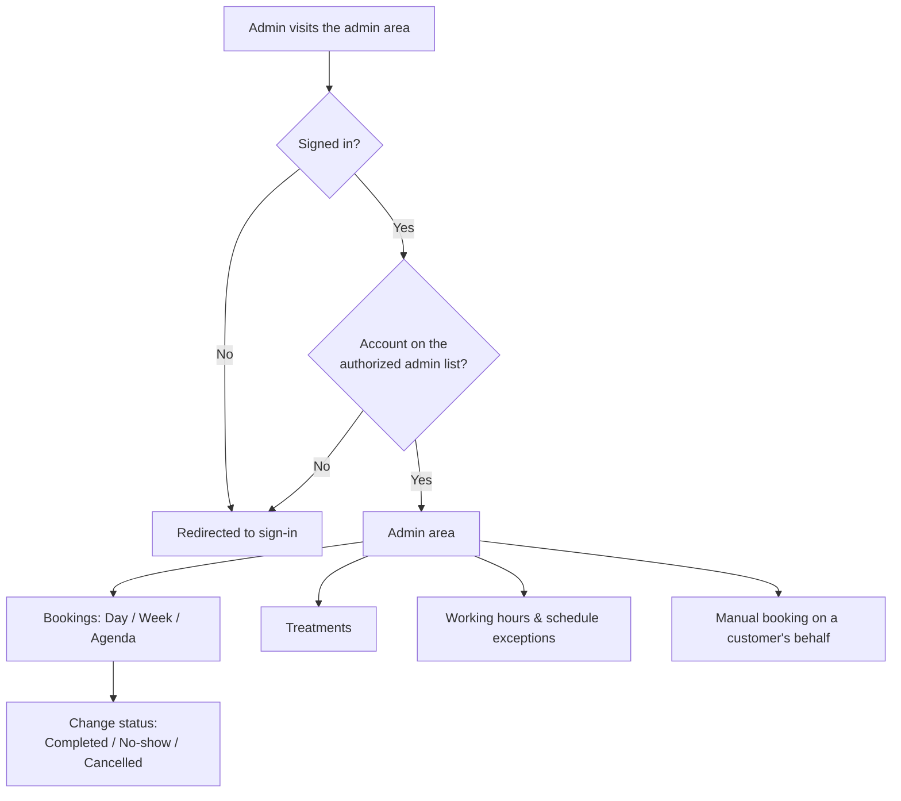
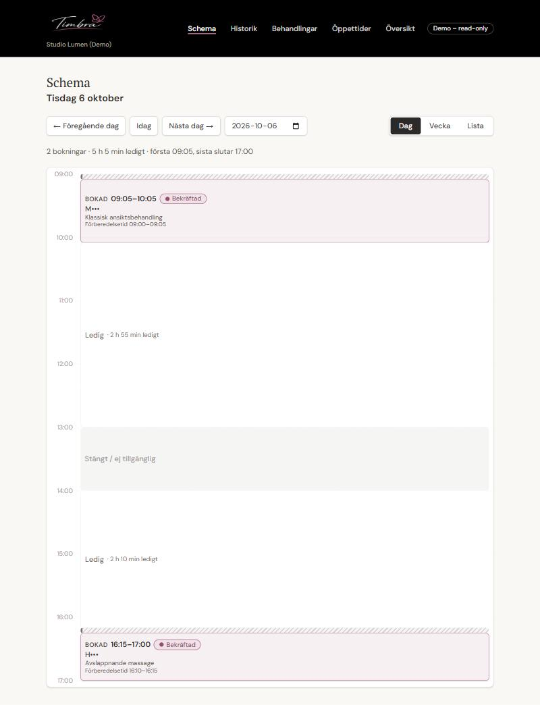
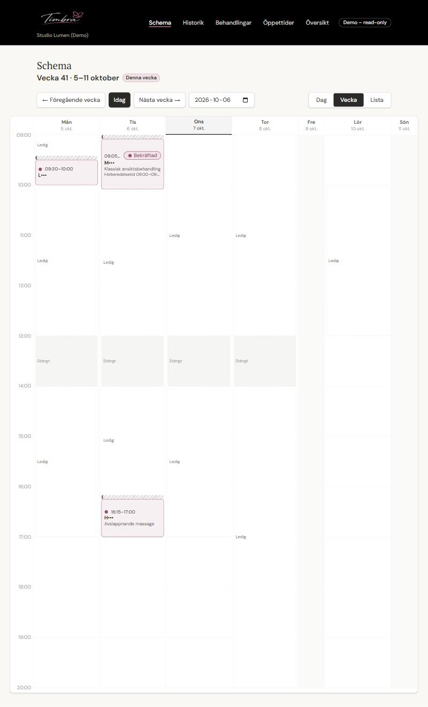
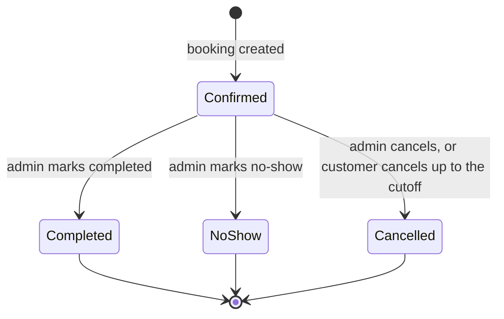

# Booking Flow

This page describes Timbra's main user flows at a high level: the customer journey, the admin journey and the booking lifecycle. Each diagram shows where testing focuses.

## 1. Customer booking journey

```mermaid
flowchart TD
    S["Customer opens the booking site<br/>(Swedish or English)"] --> T["Chooses a treatment"]
    T --> D["Chooses a date<br/>(within the booking window)"]
    D --> A["Sees the offered times<br/>(V2: edge times of each free window)<br/>one highlighted as Recommended"]
    A --> P["Picks one of the offered times"]
    P --> F["Enters name, email, phone"]
    F --> V{"Details valid?"}
    V -- "No" --> F
    V -- "Yes" --> R{"Server re-checks:<br/>is the time still offered?"}
    R -- "No longer offered" --> C["Friendly 'this time was just taken' message<br/>no booking created"]
    C --> A
    R -- "Still offered" --> B["Booking saved<br/>(database rejects any overlap)"]
    B --> OK["Confirmation page<br/>+ confirmation message queued"]
    OK --> M["Customer can later use a private<br/>manage link to view or cancel"]
```

**Where QA focuses:**

| Step | Main risks | How it's tested |
|---|---|---|
| Available times | Offering an invalid time; offering an interior time publicly (V2); hiding an offered time | Automated unit and domain-logic tests of eligibility, the V2 edge filter and ranking |
| Recommended time | Recommendation hiding the other offered times | Automated test that every offered time stays present; manual check in the browser |
| Customer details | Bad data accepted, or good data rejected | Automated validation tests with valid and invalid inputs |
| Server re-check | A stale time, or a crafted interior time (V2), gets booked | Automated recalculation tests, including the V2 public-offer re-check; database-level overlap tests |
| Saving the booking | Double booking under simultaneous requests | Automated real-database concurrency test |
| Confirmation page | Showing more data than necessary | Automated check that only a fixed summary is shown (no tokens, email or phone) |
| Whole journey in a browser | Something breaks between the steps | **Manual** end-to-end testing. No browser automation yet (see [limitations](../qa/known-limitations-and-future-qa.md)). |

## 2. Customer self-cancellation

```mermaid
flowchart TD
    L["Customer opens their private manage link"] --> K{"Link valid?"}
    K -- "No / unknown" --> N["Generic 'not found'<br/>(same response for malformed and unknown links)"]
    K -- "Yes" --> S{"Booking status<br/>still Confirmed?"}
    S -- "No" --> X["Cannot be cancelled"]
    S -- "Yes" --> C{"At least the cutoff time<br/>still remaining?"}
    C -- "No (after the cutoff)" --> Z["Rejected: contact the salon"]
    C -- "Yes" --> OK["Booking cancelled<br/>time is immediately free again"]
```

The cutoff check is a classic **boundary** test. With a 24-hour cutoff and an appointment at 15:00:

| When the customer tries to cancel | Result |
|---|---|
| Previous day, 14:59 | Allowed |
| Previous day, **exactly 15:00** | **Allowed** (the boundary itself is allowed; V1 rejected it) |
| Previous day, 15:00 and one second | Rejected |
| Previous day, 16:00 | Rejected |

## 3. Admin journey

```mermaid
flowchart TD
    V["Admin visits the admin area"] --> G1{"Signed in?"}
    G1 -- "No" --> LG["Redirected to sign-in"]
    G1 -- "Yes" --> G2{"Account on the<br/>authorized admin list?"}
    G2 -- "No" --> LG
    G2 -- "Yes" --> H["Admin area"]
    H --> B["Bookings: Day / Week / Agenda"]
    H --> T["Treatments"]
    H --> SC["Working hours & schedule exceptions"]
    H --> MB["Manual booking on a customer's behalf"]
    B --> ST["Change status:<br/>Completed / No-show / Cancelled"]
```

**Customer bookings vs admin manual bookings.** Both use the same availability engine and the same database protection. The differences are deliberate and tested:

| Rule | Customer booking | Admin manual booking |
|---|---|---|
| Working hours and schedule exceptions | Enforced | Enforced |
| Overlap with existing bookings | Enforced | Enforced |
| Preparation / treatment / buffer maths | Same | Same |
| **Minimum notice (lead time)** | Enforced | **Skipped**, because the owner is booking a customer they are already talking to |
| **Past times** | Never bookable | **Never bookable** (the admin exception covers notice only) |
| Customer notifications | Created | **Not created** |

**Current admin calendar (public demo, captured 7 October 2026 at desktop width).** The demo's admin area is read-only. The dates shown are past days with existing fictional bookings; they are not selectable in the customer flow.

*Day view, 6 October 2026: each booking card shows its customer time and its preparation range (Förberedelsetid), with a hatched 5-minute strip above it. There is no buffer after a treatment. The 13:00–14:00 break appears as "Stängt / ej tillgänglig" (closed / unavailable). Customer names are masked in the demo.*

*Week view, week 41 (5–11 October 2026): the three bookings of that week on Monday and Tuesday, each with its hatched preparation strip; the 13:00–14:00 break on Monday to Thursday; Friday and Sunday closed; Saturday open 10:00–13:00; Thursday open until 20:00. Captured on 7 October, so the page marks it as the current week ("Denna vecka").*

#### History: V1 screenshot

Captured from a local development environment with fictional data during V1. Kept as history; it is not the current interface.

**What the admin saw in V1:** the Day view shows each booking's full occupied time, meaning preparation, the appointment itself and buffer. This is the same interval the availability and collision rules use.

*V1: availability and collision checks include preparation + treatment + buffer, not only the customer-visible appointment. The V2 pilot uses no buffer (compare the current day view above).* Swedish labels: Förberedelse = preparation · Bokad = booked · Buffert / städning = buffer / cleanup. Fictional demo data.

## 4. Booking lifecycle

```mermaid
stateDiagram-v2
    [*] --> Confirmed: booking created
    Confirmed --> Completed: admin marks completed
    Confirmed --> NoShow: admin marks no-show
    Confirmed --> Cancelled: admin cancels, or customer cancels up to the cutoff
    Completed --> [*]
    NoShow --> [*]
    Cancelled --> [*]
```

- **Confirmed** is the only status that can change.
- **Completed**, **No-show** and **Cancelled** are final. Undoing them was deliberately left out of V1.
- A **cancelled** booking stops blocking the calendar at once, so the time can be booked again.
- If a customer cancels at the same moment the admin changes the status, the database resolves it cleanly and only one change wins. This is covered by an automated concurrency test.

## Related documents

- [Magnetic Booking](magnetic-booking.md)
- [Architecture overview](architecture-overview.md)
- [Test cases](../qa/test-cases/README.md)
