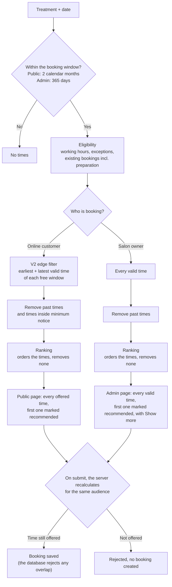
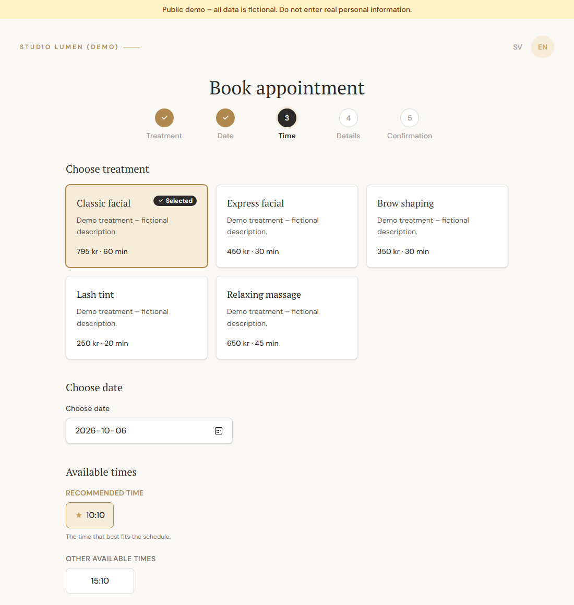

# From V1 to V2: How Timbra's Booking Logic Changed After Salon Owner Feedback

This page follows one product decision from start to finish:

**V1 idea → salon owner feedback → product decision → V2 behaviour → verification**

| Where | What it runs |
|---|---|
| [Live demo](https://timbra-booking-demo.vercel.app) | **V2 pilot**, with fictional data |
| Production (the pilot salon's site) | Not described here. It has not been verified to run V2, so this page makes no claim about it. |
| This portfolio | Documentation only. The application source code is private. |

---

## 1. V1: rank every valid time

V1's idea was **Magnetic Booking as a recommendation**:

1. Work out every time that can legally be booked (working hours, existing bookings including preparation and cleanup time, minimum notice, booking window).
2. Rank those times by how well they preserve a usable calendar (fewer and larger leftover gaps first).
3. Highlight the best one as the **recommended time**, and keep **every other valid time** visible and bookable ("a suggestion, never a restriction").

On the booking page, a customer saw one recommended time, seven alternatives and a **"Show more"** link that revealed every remaining valid time. The V1 design is documented in [Magnetic Booking: V1 design](magnetic-booking.md#v1-design-history).

## 2. What the salon owner told us

The salon owner reviewed the V1 demo in September 2026. Summarized from the session notes:

- She is usually booked about **three months ahead**, and she books her regular clients herself.
- Online booking is meant to **fill the remaining availability**, not to expose every free minute.
- Showing times scattered across the day lets a short treatment land in the middle of a long free period. That splits it into pieces that can no longer fit a long treatment.
- Free periods should be filled **from their edges inward**: from the top down and from the bottom up.
- Preparation is **5 minutes**. She does **not** need a cleanup buffer, because treatments use prepared rooms.
- Online customers should see about **two months** ahead, while she books further ahead herself.

In short, V1 assumed that customers should always see every valid time. For this salon, that assumption was wrong.

## 3. The product decision

> **Technically available is not the same as offered to a customer.**

| Decision | V2 rule |
|---|---|
| Public availability | Only the **edge times** of each free window: the earliest and the latest valid start. Times in the middle are not offered. |
| Admin availability | The salon owner keeps **every valid time**, so regular clients can still be booked anywhere. |
| Preparation | 5 minutes, booked **before** the customer's start, and shown separately in the admin calendar. |
| Buffer | 0 in the pilot workflow. The booking model still supports a buffer for other businesses. |
| Public booking window | Exactly **2 calendar months**. The exact interpretation was chosen for the pilot and is still to be confirmed with the salon owner. |
| Admin booking window | 365 days, as a technical safety limit for the pilot. |
| "Show more" | Removed from the public page: the public list is already short (at most two times per free window). |

Still open, to be confirmed with the salon owner: what an empty day should offer, whether the first client may start at 09:05 when the salon opens at 09:00, and what happens when minimum notice removes an edge time.

## 4. V2 behaviour



- **Eligibility** is unchanged from V1: it decides which times *can* be booked.
- **The V2 edge filter** is new and applies to online customers only: it decides which eligible times are *offered*.
- **Ranking** is unchanged: it only orders the times it receives and never removes one. The top-ranked offered time is still shown as recommended.
- **The server re-checks** every booking against the same audience's rules. A customer who edits the request to ask for a time in the middle of a free window is rejected, even though that time is technically free.

### Public vs admin

| | Online customer | Salon owner (admin) |
|---|---|---|
| Times offered | Edge times of each free window | Every valid time |
| Minimum notice | Applies | Skipped (a same-day booking by phone is allowed) |
| Past times | Never offered | Never offered |
| Booking window | 2 calendar months | 365 days (pilot limit) |
| "Show more" | No | Yes |

## 5. Before → after: the same day

The demo day: working hours 09:00–17:00, with two existing bookings.

| Existing booking | Customer time | Blocked in the calendar (with 5 min preparation) |
|---|---|---|
| Morning client | 09:05–10:05 | 09:00–10:05 |
| Afternoon client | 16:15–17:00 | 16:10–17:00 |

That leaves one free window, **10:05–16:10**. A customer chooses a 60-minute treatment with 5 minutes of preparation.

**Before (V1 logic on the same data).** Eight times were shown: 10:10, 10:15, 10:20, 10:25, 14:55, 15:00, 15:05 and 15:10, plus **"Show more"** for the remaining valid times. On this day, every 5-minute start from 10:10 to 15:10 is valid. This was observed on the demo on 29 September 2026, when the previous code briefly ran against the new V2 demo data just before V2 was deployed.

**After (V2).** Only **10:10** and **15:10** are offered. 12:00 is technically free, but it would split the window in two, so it is not offered.



*The same day on the live demo, captured 30 September 2026: only the two edge times are offered.*

**After one booking.** A customer books 10:10, which blocks 10:05–11:10. The window shrinks to 11:10–16:10, and the offered times become **11:15** and **15:10**. The upper edge has moved inward; the lower edge is unchanged.

```
Before:  10:05 |----------------------- free -----------------------| 16:10
Offered:        10:10                                         15:10

After booking 10:10:
         10:05 |=prep+10:10 booking=|--------- free ---------------| 16:10
Offered:                            11:15                     15:10
```

## 6. Verification

The evidence is kept separate by kind.

### Automated tests
- The full unit and domain-logic suite passed, **654 tests**, including the V2 tests below. It ran on 29 September 2026 in the demo branch, under Node.js 24. The real-database integration tests are a separate suite and are not included in this number.
- V2-specific automated tests:
  - edge selection: at most the earliest and latest valid time per free window; an exact fit is offered once; windows are handled independently;
  - the full story from section 5: offered times before, a crafted request for 12:00 rejected, the booking at 10:10, and the recalculated edges 11:15 and 15:10;
  - the public submit rejecting an interior time, and the admin submit accepting it;
  - preparation before the treatment, a zero buffer, and the calendar layout.

  The V2 cases are described in [Test cases: Magnetic Booking V2](../qa/test-cases/magnetic-booking-v2.md).

### Manual validation (local environment)
- The full V2 story was walked through manually on 29 September 2026: edge times before and after a booking, and the admin calendar showing preparation before the treatment with no buffer.
- The admin calendar layout (Day and Week views) was also checked visually.

### Demo verification (after deployment, 29 September 2026)
- The demo database was re-seeded with the V2 pilot settings (5-minute time grid, buffer 0). Its verification query returned **PASS**.
- **Public page:** "Klassisk ansiktsbehandling" offered only **10:10** and **15:10**. 12:00 was not offered, and a manually edited link asking for 12:00 did not open the booking form.
- **After a test booking at 10:10**, the page offered **11:15** and **15:10**.
- **Admin agenda:** preparation shown as its own row before each treatment, with no buffer.
- The demo was then restored to its starting state and verified again (**PASS**).
- The demo's admin area is read-only, so booking an interior time as the salon owner is covered by automated tests, not by the demo.

### Not verified yet
- **Salon owner validation of V2** is planned and has not taken place. Until then, the V2 rules are pilot behaviour, not final.
- **Production** is not claimed to run V2.

## 7. What V1 contributed to V2

- The **eligibility rules** and the **double-booking protection** carried over unchanged.
- **Ranking** carried over unchanged. It still orders the offered times and picks the recommended one.
- The V1 QA material in this portfolio (test cases, traceability, regression case studies) is kept as history. Where a V1 statement no longer describes the public behaviour, it is marked.

## Related

- [Magnetic Booking: current V2 behaviour and V1 design](magnetic-booking.md)
- [Test cases: Magnetic Booking V2](../qa/test-cases/magnetic-booking-v2.md)
- [Booking flow](booking-flow.md)
- [Try the demo](https://timbra-booking-demo.vercel.app)
