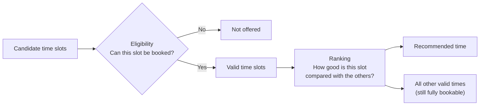
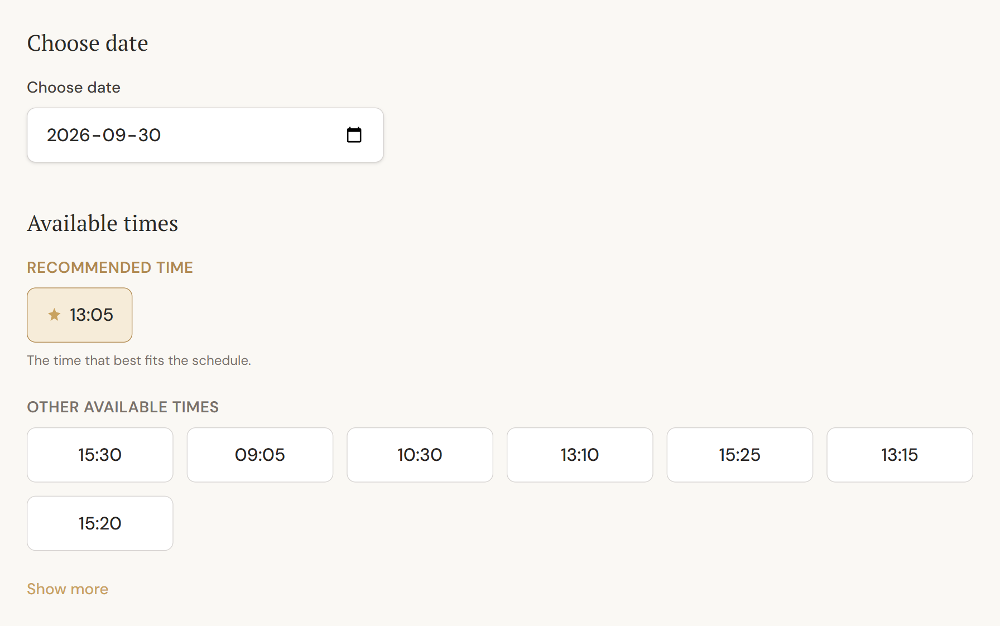

# Magnetic Booking: Eligibility vs Ranking

Magnetic Booking is the core product idea in Timbra. From a QA point of view it is also the most interesting part: two separate questions have to be answered correctly, **and must never interfere with each other**.

| Question | Name | Result |
|---|---|---|
| *"Can this time slot be booked?"* | **Eligibility** | Yes / No |
| *"How good is this valid slot compared with the other valid slots?"* | **Ranking** | An order |

The top-ranked slot is shown as the **recommended time**. The recommendation is a suggestion only: **every other valid slot remains visible and bookable.**



---

## 1. Four timestamps per booking

Every treatment has three durations: **preparation**, **treatment** and **buffer** (cleanup). The customer only sees the treatment time, but the calendar is blocked for all three.

```
occupied start   ─┐
                  │  preparation
customer start   ─┤
                  │  treatment
customer end     ─┤
                  │  buffer / cleanup
occupied end     ─┘
```

*Example:* preparation 5 min, treatment 55 min, buffer 10 min, customer start 10:00:

| Timestamp | Value |
|---|---|
| Occupied start | 09:55 |
| Customer start | 10:00 |
| Customer end | 10:55 |
| Occupied end | 11:05 |

**Collision and availability checks always use the occupied interval (09:55–11:05), never only the customer-visible interval (10:00–10:55).** This was one of the highest-risk rules to test. If it is wrong, two bookings look fine to customers but overlap in the real calendar.

**In the application:** the admin Day view shows the occupied interval directly. This demo booking (Microneedling: preparation 5 min, treatment 50 min, buffer 10 min) blocks 12:55–14:00, while the customer's appointment is 13:00–13:50.


*Occupied interval: availability and collision checks include preparation + treatment + buffer, not only the customer-visible appointment.* <sub>Swedish labels: Förberedelse = preparation · Bokad = booked · Buffert / städning = buffer / cleanup. Fictional demo data.</sub>

## 2. Eligibility: "Can this time slot be booked?"

A candidate start time is **eligible** only if **all** of these are true:

1. **The date is within the booking window.** It is not in the past and not too far ahead.
2. **The treatment is active.**
3. **The salon is open.** The occupied interval fits entirely inside one working interval. A schedule exception for that date *replaces* the weekly hours. A split day (for example 09:00–12:00 and 13:00–17:00) is never bridged across the break.
4. **No collision.** The occupied interval doesn't overlap any existing active booking's occupied interval. Back-to-back is allowed: a booking may start exactly when the previous one ends.
5. **Not in the past.** The occupied start has not already passed. This applies to **everyone**, the admin included.
6. **Enough notice.** For customer bookings, the start must be at least the minimum lead time from now. The admin may skip this rule for manual bookings, but only this rule.

Candidate times are generated on a fixed grid (every 5 minutes by default) within each free gap.

### Two layers of protection against double booking

Checking availability when the page loads isn't enough, because another customer may take the time a moment later. Timbra defends in two independent layers:

1. **Application layer.** When the customer confirms, the server recalculates availability from scratch and rejects a time that is no longer valid.
2. **Database layer.** The database itself refuses to store two overlapping active bookings. This holds even if two requests arrive at exactly the same moment.

Both layers are covered by automated tests. The database test sends two simultaneous booking requests for the same time and checks that **exactly one** succeeds.

## 3. Ranking: "How good is this valid slot?"

Ranking only ever **reorders** the eligible slots. It compares slots using three rules, in strict order:

1. **Fewer leftover fragments is better.** A slot can fill a free gap exactly (0 fragments), sit flush against one edge of the gap (1 fragment), or float in the middle and split the gap in two (2 fragments).
2. **If tied: a larger remaining free block is better.** One big usable gap is worth more than two small ones.
3. **If still tied: the earlier start time wins.** This keeps the result deterministic.

There is no weighting or hidden scoring, so every recommendation can be explained in one sentence.

### Worked example

The salon is open 09:00–12:00, and an existing booking occupies 10:00–10:30. A customer wants a 30-minute treatment (no preparation or buffer, to keep the example simple).

```
09:00        09:30        10:00   10:30                       12:00
  |------------|------------|███████|---------------------------|
                             existing
```

| Candidate | Leaves behind | Fragments | Result |
|---|---|---|---|
| **09:00** | 09:30–10:00 (30 min, still usable) | 1 | Ranked higher |
| 09:15 | 09:00–09:15 and 09:45–10:00 (two 15-min pieces) | 2 | Ranked lower |

**09:00 is recommended**, because it keeps the remaining time usable. The customer is still completely free to choose 09:15 or any other valid time.

## 4. The rule that ties it together

> **Ranking changes the order of valid times. It never changes which times are valid.**

- A slot that is not eligible can never become bookable by ranking well.
- An eligible slot can never become unbookable by ranking poorly.
- The recommendation never hides or disables other valid times.

These guarantees are tested as requirements in their own right: see [MAG-004 and MAG-005](../qa/test-cases/magnetic-ranking.md).

**In the application:** an 80-minute treatment (95 minutes occupied) on a split Wednesday, 09:00–12:00 and 13:00–17:00, with no other bookings. The best candidates each sit flush against one edge of a working period, leaving one free fragment, so rule 1 ties between them. **13:05 wins**. Rule 2 prefers the afternoon options, which leave a larger remaining free block in the longer afternoon period. Rule 3 then picks the earliest of those. The earliest valid time, **09:05**, is not recommended, but it is still offered with all the other valid times.



*Magnetic Booking: all valid times remain bookable. Timbra recommends the slot that best preserves an efficient calendar.*

## 5. Why this design is testable

- Eligibility and ranking are separate, **pure** calculations: plain data in, plain data out, with no database, network or hidden clock. They can be tested in milliseconds with hand-built scenarios.
- The current time is always passed in explicitly. That makes exact boundary instants testable, for example "exactly at the cutoff" or "one minute before the minimum notice".
- The database's own overlap protection is tested separately against a **real** database, not a mock, because only a real database can prove the constraint actually holds.

## Related documents

- [Test cases: booking engine](../qa/test-cases/booking-engine.md)
- [Test cases: Magnetic Ranking](../qa/test-cases/magnetic-ranking.md)
- [Booking flow](booking-flow.md)
- [Traceability examples](../qa/traceability-examples.md)
