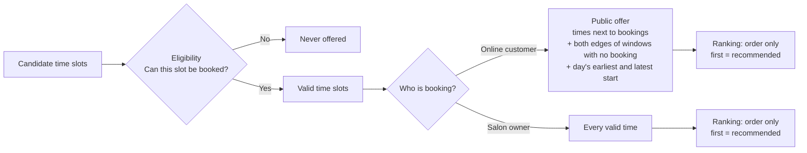
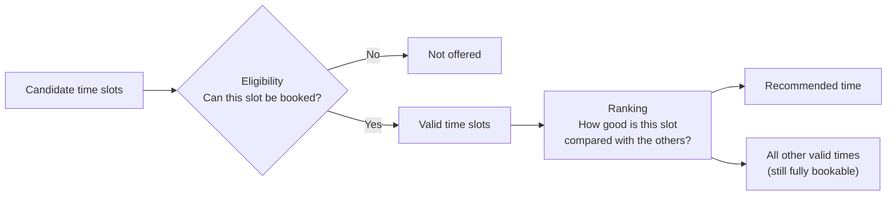

# Magnetic Booking: Eligibility, the V2 Edge Filter and Ranking

Magnetic Booking is the core product idea in Timbra: the booking logic protects the salon's calendar from unusable gaps. This page describes the **current V2 behaviour**, which the [live demo](https://timbra-booking-demo.vercel.app) runs, and keeps the **V1 design** as history. [From V1 to V2](evolution-v1-to-v2.md) explains why it changed.

## Current behaviour (V2, release v2.1.0)

> **Since v2.1.0 (6 October 2026):** an online customer is offered, for each free window, the time next to an existing booking (or both edges of a window that has no booking on either side), **plus the day's earliest and latest start** that still pass the notice-period check. The first V2 offered both edges of every free window (30 September screenshot below); from 30 September only the booking-side edge was offered next to a booking. The day extremes keep a morning and an evening option on days with a single booking. Offered times are shown in time order with the recommended one marked.

Three separate questions are answered, in this order:

| Question | Name | Applies to | Result |
|---|---|---|---|
| *"Can this time slot be booked?"* | **Eligibility** | Everyone | Yes / No |
| *"Should this eligible time be offered to an online customer?"* | **Public offer** | Online customers only | Offered / not offered |
| *"How good is this time compared with the others?"* | **Ranking** | Everyone | An order |


```mermaid
flowchart LR
    A["Candidate time slots"] --> B{"Eligibility<br/>Can this slot be booked?"}
    B -- "No" --> X["Never offered"]
    B -- "Yes" --> C["Valid time slots"]
    C --> D{"Who is booking?"}
    D -- "Online customer" --> E["Public offer<br/>times next to bookings<br/>+ both edges of windows with no booking<br/>+ day's earliest and latest start"]
    D -- "Salon owner" --> F["Every valid time"]
    E --> R1["Ranking: order only<br/>first = recommended"]
    F --> R2["Ranking: order only<br/>first = recommended"]
```

- **The public offer restricts** what online customers are offered: the times next to existing bookings, both edges of a window that has no booking on either side, and the day's earliest and latest eligible start. Breaks (for example a 13:00–14:00 lunch), opening and closing are not treated as bookings: next to a booking, only the booking-side time is offered. As bookings are made, new times attach to them, so the day fills from both ends and around bookings.
- **Ranking only orders.** It never adds or removes a time; the first one it returns is marked as recommended.
- **Neither step can make an ineligible time bookable.** The server re-checks every booking against the same audience's rules, so a customer cannot book an interior time by editing the request.
- **The salon owner keeps every valid time** in the admin area.


*Scrolled view of the public demo, captured 7 October 2026 (v2.1.0); the demo's fictional-data notice sits just above the visible area. "Classic facial" (60 min, 5 min preparation), days from 20 October 2026, which have no bookings according to the read-only admin. Each day is split by the 13:00–14:00 break into two windows with no booking, and each window offers its earliest and latest start (09:05 and 12:00; 14:05 and 16:00, or 19:00 on Thursday's longer day). Times are listed in time order; the recommended time comes from ranking. On that date the demo had no bookings on any selectable future day, so the time next to an existing booking could not be shown live; it is covered by automated tests ([MB2-003, MB2-005](../qa/test-cases/magnetic-booking-v2.md)).*

The full V2 flow (booking window, minimum notice, server re-check) and a before → after example are in [From V1 to V2](evolution-v1-to-v2.md#4-v2-behaviour).

## V1 design (history)

In V1, only two questions were answered: **eligibility** and **ranking**. The top-ranked slot was shown as the recommended time, and **every other valid slot remained visible and bookable** for the customer.


```mermaid
flowchart LR
    A["Candidate time slots"] --> B{"Eligibility<br/>Can this slot be booked?"}
    B -- "No" --> X["Not offered"]
    B -- "Yes" --> C["Valid time slots"]
    C --> D["Ranking<br/>How good is this slot<br/>compared with the others?"]
    D --> E["Recommended time"]
    D --> F["All other valid times<br/>(still fully bookable)"]
```

The sections below explain the mechanics shared by V1 and V2. Where V2 differs, a note says so.

---

## 1. Four timestamps per booking

Every treatment has three durations: **preparation**, **treatment** and **buffer** (cleanup). The customer only sees the treatment time, but the calendar is blocked for all three.

> **V2 pilot:** the pilot salon uses 5 minutes of preparation and **no buffer** (buffer = 0). The model below still supports a buffer, and the V1 example keeps one.

```
occupied start   ─┐
                  │  preparation
customer start   ─┤
                  │  treatment
customer end     ─┤
                  │  buffer / cleanup
occupied end     ─┘
```

*Example:* preparation 5 min, treatment 55 min, buffer 10 min, customer start 10:00:

| Timestamp | Value |
|---|---|
| Occupied start | 09:55 |
| Customer start | 10:00 |
| Customer end | 10:55 |
| Occupied end | 11:05 |

**Collision and availability checks always use the occupied interval (09:55–11:05), never only the customer-visible interval (10:00–10:55).** This was one of the highest-risk rules to test. If it is wrong, two bookings look fine to customers but overlap in the real calendar.

#### History: V1 screenshot

Captured from a local development environment with fictional data during V1. Kept as history; it is not the current interface.

**In the application (V1):** the admin Day view shows the occupied interval directly. This demo booking (Microneedling: preparation 5 min, treatment 50 min, buffer 10 min) blocks 12:55–14:00, while the customer's appointment is 13:00–13:50.


*Historical V1 screenshot. Occupied interval: availability and collision checks include preparation + treatment + buffer, not only the customer-visible appointment. In the V2 pilot, this booking would have no buffer segment.* <sub>Swedish labels: Förberedelse = preparation · Bokad = booked · Buffert / städning = buffer / cleanup. Fictional demo data.</sub>

## 2. Eligibility: "Can this time slot be booked?"

A candidate start time is **eligible** only if **all** of these are true:

1. **The date is within the booking window.** It is not in the past and not too far ahead.
2. **The treatment is active.**
3. **The salon is open.** The occupied interval fits entirely inside one working interval. A schedule exception for that date *replaces* the weekly hours. A split day (for example 09:00–12:00 and 13:00–17:00) is never bridged across the break.
4. **No collision.** The occupied interval doesn't overlap any existing active booking's occupied interval. Back-to-back is allowed: a booking may start exactly when the previous one ends.
5. **Not in the past.** The occupied start has not already passed. This applies to **everyone**, the admin included.
6. **Enough notice.** For customer bookings, the start must be at least the minimum lead time from now. The admin may skip this rule for manual bookings, but only this rule.

Candidate times are generated on a fixed grid (every 5 minutes by default) within each free gap.

### Two layers of protection against double booking

Checking availability when the page loads isn't enough, because another customer may take the time a moment later. Timbra defends in two independent layers:

1. **Application layer.** When the customer confirms, the server recalculates availability from scratch and rejects a time that is no longer valid.
2. **Database layer.** The database itself refuses to store two overlapping active bookings. This holds even if two requests arrive at exactly the same moment.

Both layers are covered by automated tests. The database test sends two simultaneous booking requests for the same time and checks that **exactly one** succeeds.

## 3. Ranking: "How good is this valid slot?"

Ranking only ever **reorders** the eligible slots. It compares slots using three rules, in strict order:

1. **Fewer leftover fragments is better.** A slot can fill a free gap exactly (0 fragments), sit flush against one edge of the gap (1 fragment), or float in the middle and split the gap in two (2 fragments).
2. **If tied: a larger remaining free block is better.** One big usable gap is worth more than two small ones.
3. **If still tied: the earlier start time wins.** This keeps the result deterministic.

There is no weighting or hidden scoring, so every recommendation can be explained in one sentence.

### Worked example

The salon is open 09:00–12:00, and an existing booking occupies 10:00–10:30. A customer wants a 30-minute treatment (no preparation or buffer, to keep the example simple).

```
09:00        09:30        10:00   10:30                       12:00
  |------------|------------|███████|---------------------------|
                             existing
```

| Candidate | Leaves behind | Fragments | Result |
|---|---|---|---|
| **09:00** | 09:30–10:00 (30 min, still usable) | 1 | Ranked higher |
| 09:15 | 09:00–09:15 and 09:45–10:00 (two 15-min pieces) | 2 | Ranked lower |

**09:00 is recommended**, because it keeps the remaining time usable. In V1, the customer could still choose 09:15 or any other valid time.

**In V2 (v2.1.0)**, the same day has two free windows: 09:00–10:00 and 10:30–12:00. An online customer is offered **09:30 and 10:30** (next to the booking) and **09:00 and 11:30** (the day's earliest and latest start). 09:15 is not offered, because it would split the first window. Ranking then orders those four times. The salon owner can still book 09:15.

## 4. The rules that tie it together

> **Ranking changes the order of valid times. It never changes which times are valid.**

- A slot that is not eligible can never become bookable by ranking well.
- An eligible slot can never become unbookable by ranking poorly.
- The recommendation never hides or disables another **offered** time. In V1 every valid time was offered to the customer; in V2 the customer is offered the public offer described above, and the salon owner every valid time.
- **V2:** the public offer only ever selects from eligible times. It never adds a time that isn't eligible.

These guarantees are tested as requirements in their own right: see [MAG-004 and MAG-005](../qa/test-cases/magnetic-ranking.md) and the [V2 test cases](../qa/test-cases/magnetic-booking-v2.md).

#### History: V1 screenshot

Captured from a local development environment with fictional data during V1. Kept as history; it is not the current interface.

**In the application (V1):** an 80-minute treatment (95 minutes occupied) on a split Wednesday, 09:00–12:00 and 13:00–17:00, with no other bookings. The best candidates each sit flush against one edge of a working period, leaving one free fragment, so rule 1 ties between them. **13:05 wins**. Rule 2 prefers the afternoon options, which leave a larger remaining free block in the longer afternoon period. Rule 3 then picks the earliest of those. The earliest valid time, **09:05**, is not recommended, but it is still offered with all the other valid times.


*Historical V1 screenshot: all valid times remained bookable, and Timbra recommended the slot that best preserved an efficient calendar. In V2, online customers see only the edge times of each free window.*

## 5. Why this design is testable

- Eligibility and ranking are separate, **pure** calculations: plain data in, plain data out, with no database, network or hidden clock. They can be tested in milliseconds with hand-built scenarios.
- The current time is always passed in explicitly. That makes exact boundary instants testable, for example "exactly at the cutoff" or "one minute before the minimum notice".
- The database's own overlap protection is tested separately against a **real** database, not a mock, because only a real database can prove the constraint actually holds.

## Related documents

- [From V1 to V2](evolution-v1-to-v2.md)
- [Test cases: Magnetic Booking V2](../qa/test-cases/magnetic-booking-v2.md)
- [Test cases: booking engine](../qa/test-cases/booking-engine.md)
- [Test cases: Magnetic Ranking](../qa/test-cases/magnetic-ranking.md)
- [Booking flow](booking-flow.md)
- [Traceability examples](../qa/traceability-examples.md)
