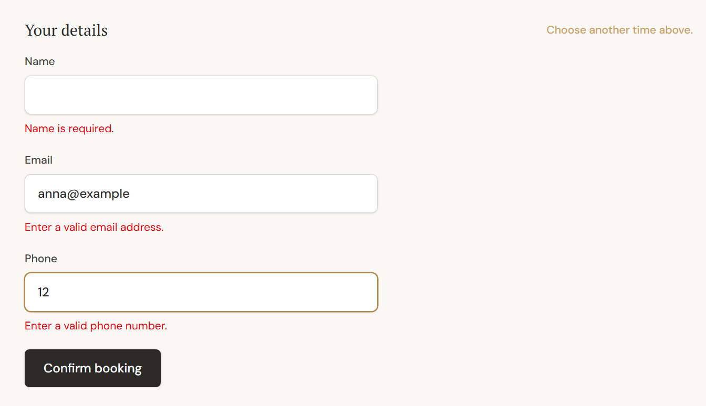

# Boundary and Negative Testing

Booking systems are full of **exact edges**: *"at least 2 hours' notice"*, *"until 24 hours before"*, *"back-to-back is allowed"*, *"the clock jumps at 02:00"*. Most time-related defects hide at these edges, so boundary and negative testing were central to how Timbra was tested.

Because the current time is always **passed in explicitly** to the business logic, every boundary below can be tested at the *exact* instant, deterministically.

## 1. Boundary value analysis

| Rule | Just inside | **On the boundary** | Just outside | Test case |
|---|---|---|---|---|
| Minimum notice (120 min, now = 10:00) | 12:05 → offered | **12:00 → offered** (boundary allowed) | 11:59 → not offered | [BK-010](test-cases/booking-engine.md#bk-010-minimum-notice-for-customer-bookings-lead-time) |
| Cancellation cutoff (appointment Fri 15:00, 24 h) | Thu 14:59 → allowed | **Thu 15:00 → rejected** (boundary *not* allowed) | Thu 16:00 → rejected | [CAN-003 / 004 / 005](test-cases/cancellation.md) |
| Back-to-back bookings (previous occupied end 11:05) | — | **Occupied start 11:05 → allowed** | Occupied start 11:00 → rejected | [BK-004](test-cases/booking-engine.md#bk-004-back-to-back-bookings-are-allowed) |
| Past-time floor (now = 16:00, prep 5 min) | Customer start 16:10 → offered | **Customer start 16:00 → rejected** (its occupied start 15:55 is already past) | Earlier today → rejected | [ADM-007](test-cases/booking-engine.md#adm-007-the-admin-still-cannot-book-a-past-time) |
| Split working day (09:00–12:00 / 13:00–17:00) | Occupied end 12:00 → allowed | — | Any overlap with 12:00–13:00 → rejected | [BK-005](test-cases/booking-engine.md#bk-005-a-split-working-day-is-never-bridged) |
| Booking window | Today, and the last allowed day ahead | — | Yesterday, or one day beyond the window → no availability | (automated; not in this selection) |
| DST spring forward | 01:59, 03:00 → valid | **02:00–02:59 → do not exist → rejected** | — | [TZ-002](test-cases/timezone-dst.md#tz-002-a-local-time-that-doesnt-exist-spring-forward-is-rejected) |
| DST fall back | 01:59, 03:00 → valid | **02:00–02:59 → occur twice → rejected** | — | [TZ-003](test-cases/timezone-dst.md#tz-003-an-ambiguous-local-time-fall-back-is-rejected) |
| Cutoff across DST | — | **24 *real* hours, not clock-face hours** | — | [TZ-007](test-cases/timezone-dst.md#tz-007-the-cancellation-cutoff-stays-correct-across-a-dst-change) |

**What the boundaries show:** the rules don't all treat the boundary the same way. Minimum notice **includes** its boundary (exactly 2 hours is enough). The cancellation cutoff **excludes** its boundary (exactly 24 hours before is too late). A test suite that only checked "clearly before" and "clearly after" would miss an off-by-one in either direction. Each boundary is a separate, explicit case.

### Seen in the application

**Schedule boundaries.** These are the rules behind the split-day and schedule-exception cases: Wednesday is split into 09:00–12:00 and 13:00–17:00, and a single date is overridden to 10:00–14:00.

*Schedule rules under test: recurring working hours can contain split periods, while a date-specific override replaces the normal schedule for that date.* Swedish labels: Ordinarie arbetstider = regular working hours · Onsdag = Wednesday · Stängt = closed · Anpassade dagar = custom (overridden) days. Fictional demo data.

**Cancellation cutoff.** The screenshot below shows the **after-cutoff** state (the CAN-005 situation). The booking is still *Confirmed*, but its cancellation cutoff has passed, so online cancellation is refused. It does **not** show the exact 24-hour boundary instant. That instant (CAN-004) is verified by automated tests with an injected clock, because it can't be captured reliably by hand.

*Boundary/business-rule testing: once the cancellation cutoff has passed, online cancellation is no longer available.* Cropped from the customer "Manage your booking" page. Fictional demo booking.

## 2. Negative testing

| Area | Invalid input or situation | Expected behaviour |
|---|---|---|
| Customer details | Malformed emails (several variants), malformed phone numbers, empty or over-long names | Field-level errors; nothing saved |
| Treatment data (admin) | Negative price, zero or negative treatment duration, negative prep/buffer | Rejected with field errors. *Zero* prep/buffer is valid (an equivalence-partitioning decision). |
| Stale time | A time that was free when the page loaded, but was taken before submit | Server re-check rejects it; friendly "just taken" message |
| Overlapping booking | Saved directly, bypassing application checks | [Database rejects it](test-cases/booking-engine.md#bk-006-the-database-rejects-an-overlapping-booking) |
| Overlapping working hours | Two overlapping intervals for the same weekday | Database rejects them |
| Conflicting schedule exceptions | Two conflicting overrides for one date | Database rejects them |
| Status transitions | e.g. *Completed → Confirmed* | Rejected by both the business rule and the database (final statuses can't change) |
| Manage link | Malformed link, and a well-formed but unknown link | **Identical** generic "not found" response for both, so nobody can probe for real bookings |
| Cancellation | Booking already *Completed* or *No-show* | "Not cancellable" outcome |
| Admin access | Not signed in; signed in but not allow-listed; allow-list missing | [Denied in all three cases](test-cases/auth-and-security.md) |
| Time conversion | Non-existent or ambiguous local time | Explicit error, never a guess |

**Seen in the application:** the customer details form after submitting an empty name, a malformed email (`anna@example`) and a malformed phone number (`12`). Each field is rejected individually. In the local demo environment, the booking and customer counts were checked before and after the submission, and nothing had been saved.

*Negative testing: invalid or missing customer details are rejected with field-level validation before a booking is created.*

## 3. Equivalence partitioning examples

| Input | Partitions tested |
|---|---|
| Day type | Normal open day · split day · closed weekday · closed by exception · different hours by exception |
| Caller | Customer (notice enforced) · Admin (notice skipped, past floor still enforced) |
| Booking status | Confirmed (can change) · Completed / No-show / Cancelled (final) |
| Admin identity | Anonymous · authenticated not authorized · authorized |
| English content for a treatment | Present · blank or whitespace-only (falls back to Swedish) |
| Booking source | Customer-created (notifications created) · admin-created (no notifications) |

## 4. Why "negative" also means "proving a zero"

Some important rules are *absences*: an admin-created booking must create **zero** customer notifications. A test that only checks for zero can pass by accident, for example when notifications are switched off entirely. So the test is **paired**. An otherwise identical customer-created booking, with the same settings, must create its normal notifications. Only then does "zero" for the admin booking mean something.

## Related

- [Test cases](test-cases/README.md)
- [Test types & approach](test-types-and-approach.md)
- [Regression case studies](regression-case-studies.md): two of the real defects were edge-case defects (a past-time edge and an extreme-size layout edge)
