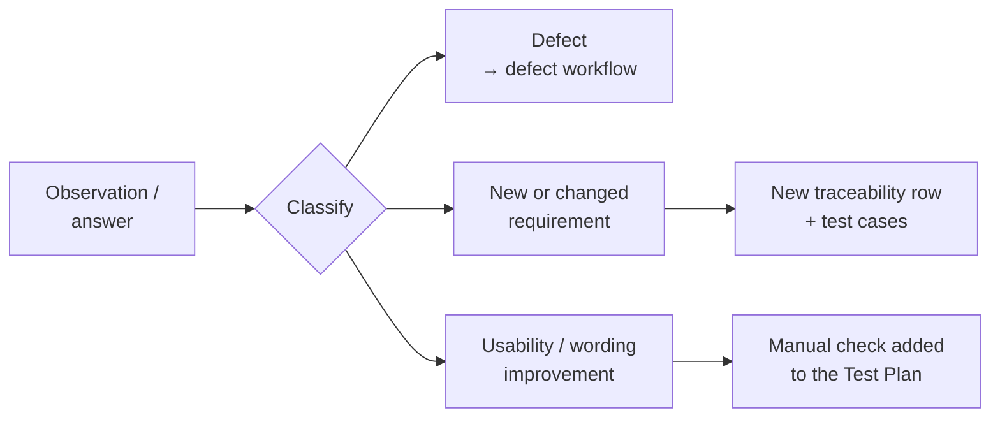

# Planned Stakeholder Usability Session

Passing tests show that the system behaves as specified. They don't show that the specification fits how the **salon owner** actually works. This planned session is meant to close that gap: a guided walkthrough of V1 with its primary user, followed by hands-on use.

> **Status: planned, not yet conducted.** This document is a planned QA / user-acceptance approach: the script, the observation method and the questions. It contains no findings or results, because the session has not taken place yet.

## Goals

1. Confirm that the core flows match the owner's real way of working.
2. See where a non-technical user **hesitates or gets confused**, without prompting.
3. Check that the recommended time feels natural and not pushy.
4. Collect missing requirements before a wider rollout.

## Principles

- **No technical language.** The walkthrough never mentions databases, frameworks or infrastructure.
- **Example data only.** The session runs on a local environment with fictional treatments, schedules and customers. No real customer data is used, and no real messages are sent.
- **Observe, don't defend.** When the owner hesitates, note it. Don't explain it away in the moment. A hesitation is useful data whatever the reason.

## Part 1: Guided walkthrough (5–10 minutes)

| Step | What is shown | What is said (in plain language) |
|---|---|---|
| 1 | Treatment management | "This is where you manage your treatments: name, price and how long each one takes." |
| 2 | Weekly schedule and exceptions | "Your regular hours, plus exceptions for a specific date, like a shorter day or a day off." |
| 3 | Customer booking (new browser window) | "This is what a customer sees: treatment, then date…" |
| 4 | Recommended time | "Customers can choose any available time. The system simply recommends the one that fits your calendar best." |
| 5 | Booking confirmation | "Booked. The customer sees this confirmation immediately." |
| 6 | Confirmation message (local email catcher) | "On the live site this goes to the customer's inbox. Here it's captured locally, so we can read it safely." |
| 7 | Booking in the admin view | "The same booking, on your side." |
| 8 | Manage link and cancellation | "Customers can cancel themselves up to the cutoff. After that, they contact you." |
| 9 | Status changes | "Mark a booking completed or no-show, or cancel it yourself." |
| 10 | English version | "The same flow works in English." |

If asked *why* a certain time is recommended: *"Every time on this list can be booked. The recommended one is first because it leaves you a cleaner, more usable gap afterwards, instead of a leftover slot that's too short for anything."*

## Part 2: Hands-on use (unguided)

- Ask the owner to book an appointment **as a customer would**. Don't say where to click.
- Give a small admin task, for example: *"Where would you go to change Tuesday's hours?"*
- Observe and note: hesitations, unexpected clicks, confusing wording, and things looked for but not found.

## Part 3: Questions

Open questions, meant to bring out real preferences rather than confirm assumptions:

| Topic | Question |
|---|---|
| Treatments | Are these the right treatments, prices and durations? Anything missing or to retire? |
| Schedule | Does the weekly schedule match your real hours? Any recurring exceptions? |
| Recommendation | How did the recommended time feel? Natural, or would you explain it differently to customers? |
| Customer data | Is name, email and phone enough to run a booking? |
| Cancellation | Is the cancellation cutoff the rule you want? |
| Message wording | Do the confirmation and reminder texts sound right to you? |
| Usability | Was there any point where you weren't sure what to click, or what would happen next? |
| Workflow fit | Does this reflect how you actually manage your appointments? |
| Readiness | What would need to change before you'd feel comfortable using this for real? |

## How findings feed back into QA

## Why this belongs in a QA portfolio

This is **acceptance-oriented, user-centred validation**. It checks that the right thing was built, not only that the thing was built right. It complements the automated suite, which can only check behaviour that has already been specified.
