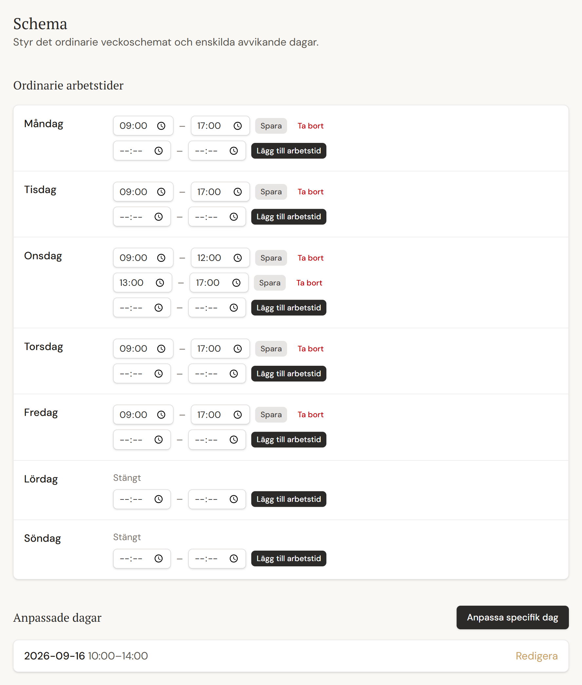

# Test Cases: Booking Engine

These cases cover **eligibility** (*"Can this time slot be booked?"*): the booking duration model, working-hour boundaries, schedule exceptions, minimum notice, collisions and customer vs admin rules. Background: [Magnetic Booking](../../product/magnetic-booking.md).

**Illustrative treatment used below (unless stated otherwise):** preparation 5 min · treatment 55 min · buffer 10 min · 5-minute slot grid.

---

### BK-001: Four-timestamp calculation

| Field | Value |
|---|---|
| Requirement | REQ-BK-001: each booking derives occupied and customer start/end times by exact formula |
| Risk | RISK-001 Double booking (a wrong calendar block leads to hidden overlaps) |
| Priority | Critical |
| Technique | Positive |
| Level | Unit |
| Preconditions | A treatment with known preparation, treatment and buffer minutes |
| Test data | Customer start 10:00; prep 5; treatment 55; buffer 10 |
| Steps | 1. Build the booking slot for a 10:00 customer start |
| Expected result | Occupied start **09:55** · customer start **10:00** · customer end **10:55** · occupied end **11:05** |
| Automation | Automated |
| Evidence | Automated unit test (booking duration). The same formula is also enforced by the database. |

### BK-002: Collisions use the occupied interval, not the customer-visible interval

| Field | Value |
|---|---|
| Requirement | REQ-BK-002: collision checks use the full occupied interval (preparation → buffer) |
| Risk | RISK-001 Double booking |
| Priority | Critical |
| Technique | Negative |
| Level | Domain logic |
| Preconditions | Existing booking: customer 10:00–10:55, occupied **09:55–11:05** |
| Test data | Candidate customer start **11:00** for the same treatment (occupied 10:55–12:05) |
| Steps | 1. Generate eligible slots for the day 2. Check whether 11:00 is offered |
| Expected result | **11:00 is not eligible.** The customer-visible times (10:55 end / 11:00 start) don't overlap, but the occupied intervals do. The first eligible start after the existing booking is **11:10** (occupied start 11:05). |
| Automation | Automated |
| Evidence | Automated domain-logic test (availability) |
| Notes | This rule is invisible to customers, which makes it a classic hidden-defect risk |

### BK-004: Back-to-back bookings are allowed

| Field | Value |
|---|---|
| Requirement | REQ-BK-003: slots respect boundaries and allow adjacency |
| Risk | RISK-001 (too strict wastes calendar time; too loose double-books) |
| Priority | High |
| Technique | Boundary |
| Level | Domain logic |
| Preconditions | Existing booking with occupied end **11:05** |
| Test data | Candidate with occupied start exactly **11:05** (customer start 11:10) |
| Steps | 1. Generate eligible slots 2. Check the candidate starting exactly at the previous occupied end |
| Expected result | **Eligible.** Intervals are start-inclusive and end-exclusive, so no gap is needed between bookings. A candidate with occupied start **11:00** is not eligible. |
| Automation | Automated |
| Evidence | Automated domain-logic test (availability) |

### BK-005: A split working day is never bridged

| Field | Value |
|---|---|
| Requirement | REQ-BK-003 / REQ-SCH-004: a booking may not span the gap between two working intervals |
| Risk | Slot offered during a break (such as lunch) |
| Priority | High |
| Technique | Negative |
| Level | Domain logic |
| Preconditions | Working intervals **09:00–12:00** and **13:00–17:00** on the same day; no bookings |
| Test data | Treatment with occupied duration 70 min |
| Steps | 1. Generate eligible slots across the day |
| Expected result | The last morning slot has occupied end ≤ 12:00. The first afternoon slot has occupied start ≥ 13:00. **No slot overlaps 12:00–13:00.** |
| Automation | Automated |
| Evidence | Automated domain-logic test (availability) |

### SCH-002: A schedule exception fully replaces the weekly hours

| Field | Value |
|---|---|
| Requirement | REQ-SCH-002: a date-specific override replaces, and never merges with, the weekly schedule |
| Risk | Weekly hours leak into a day that should be different |
| Priority | Critical |
| Technique | Positive |
| Level | Domain logic |
| Preconditions | Weekly schedule for Wednesdays: 09:00–17:00. Override for one specific Wednesday: **10:00–14:00**. |
| Steps | 1. Resolve the effective schedule for that Wednesday 2. Generate eligible slots |
| Expected result | Only 10:00–14:00 applies. **No slots before 10:00 or after 14:00.** Other Wednesdays still use 09:00–17:00. |
| Automation | Automated |
| Evidence | Automated domain-logic test (schedule resolution) |
| Notes | A related case (SCH-003) checks that a *closed* override gives zero availability even on a normally open weekday |

**Test data seen in the application (BK-005 and SCH-002):** the local demo schedule has a split Wednesday and a single date overridden to 10:00–14:00.

*Schedule rules under test: recurring working hours can contain split periods, while a date-specific override replaces the normal schedule for that date.* Swedish labels: Ordinarie arbetstider = regular working hours · Onsdag = Wednesday · Stängt = closed · Anpassade dagar = custom (overridden) days. Fictional demo data.

### BK-010: Minimum notice for customer bookings (lead time)

| Field | Value |
|---|---|
| Requirement | REQ-BK-008: customer bookings need at least the configured minimum notice |
| Risk | Customer books with too little notice for the salon to prepare |
| Priority | High |
| Technique | Boundary |
| Level | Domain logic |
| Preconditions | Minimum notice: 120 min. Current time injected as **10:00**. |
| Test data | Customer starts 11:59, **12:00** and 12:05 |
| Steps | 1. Apply the minimum-notice filter to each candidate |
| Expected result | 11:59 → **rejected** (one minute short) · 12:00 → **accepted** (exact boundary) · 12:05 → accepted |
| Automation | Automated |
| Evidence | Automated domain-logic test (lead time) |
| Notes | The rule is measured from the *customer* start. The salon's preparation time isn't the customer's concern. |

### BK-006: The database rejects an overlapping booking

| Field | Value |
|---|---|
| Requirement | REQ-BK-004 / REQ-DB-001: the database rejects overlapping active bookings, whatever the application does |
| Risk | RISK-001 Double booking |
| Priority | Critical |
| Technique | Negative |
| Level | DB integration (real local PostgreSQL) |
| Preconditions | A confirmed booking with occupied interval 09:55–11:05 |
| Steps | 1. Attempt to save a booking whose occupied interval overlaps 09:55–11:05, bypassing the application's own availability check |
| Expected result | The **database rejects it**. The application turns this into a friendly "time was just taken" message. No partial data (such as an orphaned customer record) remains. |
| Automation | Automated |
| Evidence | Automated real-database integration test |
| Notes | The application also re-checks availability on the server just before saving. That check is partly automated; its request handler has no dedicated test (a documented gap). The database is the final protection. |

### BK-008: Simultaneous booking requests (exactly one wins)

| Field | Value |
|---|---|
| Requirement | REQ-BK-006 / REQ-DB-005: concurrent attempts at the same time resolve safely |
| Risk | RISK-001 Double booking under real concurrency |
| Priority | Critical |
| Technique | Concurrency |
| Level | DB integration (real local PostgreSQL) |
| Preconditions | A free slot |
| Steps | 1. Send **two booking requests for the identical slot at the same moment** |
| Expected result | **Exactly one succeeds.** The other gets a conflict. There is no duplicate and no orphaned data. |
| Automation | Automated |
| Evidence | Automated real-database concurrency test |
| Notes | A race like this can't be tested reliably by hand |

### ADM-006: Admin manual booking may skip minimum notice

| Field | Value |
|---|---|
| Requirement | REQ-ADM-004: admin manual bookings skip the minimum-notice policy, and **only** that rule |
| Risk | The admin can't book a same-day phone customer, or the bypass loosens other rules |
| Priority | High |
| Technique | Positive (paired with the customer flow as a control) |
| Level | DB integration (availability against a real local database) |
| Preconditions | Minimum notice 120 min. Current time injected as 10:00. The salon is open and 10:30 is free. |
| Test data | Customer start **10:30** |
| Steps | 1. Request availability as a customer 2. Request the same availability as the admin |
| Expected result | Customer: 10:30 **not offered**. Admin: 10:30 **offered**. Working hours, overrides and collisions are still enforced for the admin. |
| Automation | Automated |
| Evidence | Automated integration test (availability) |

### ADM-007: The admin still cannot book a past time

| Field | Value |
|---|---|
| Requirement | REQ-BK-007 / REQ-ADM-004: past times are never bookable, for anyone |
| Risk | RISK-003 Booking offered or created in the past |
| Priority | Critical |
| Technique | Boundary / Negative |
| Level | DB integration + unit |
| Preconditions | Admin manual booking (notice bypass active). Current time injected as **16:00**. Preparation 5 min. |
| Test data | Customer start **16:00** (occupied start **15:55**, already past) · a slot several hours earlier the same day · customer start 16:10 (occupied start 16:05) |
| Steps | 1. Request admin availability for the day |
| Expected result | The 16:00 start is **not offered**, because its occupied start is already past. Earlier slots are **not offered**. The 16:10 start is offered (if free and within working hours). |
| Automation | Automated |
| Evidence | Automated unit and integration tests, added as regression protection for a real defect (see [case study 2](../regression-case-studies.md#case-study-2--admin-notice-bypass-also-bypassed-the-past-time-safety-floor)) |
