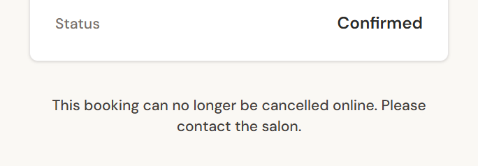

# Test Cases: Cancellation

Customers cancel through a **private manage link**, with no account needed. Cancellation is allowed only **strictly before** a configurable cutoff (24 hours in V1).

**Illustrative setup:** appointment on Friday at **15:00**, cutoff 24 hours, so the cutoff instant is **Thursday 15:00**. The current time is injected in each case.

| Attempt (Thursday) | 14:59 | **15:00** | 16:00 |
|---|---|---|---|
| Expected | Allowed | **Rejected** | Rejected |
| Case | CAN-003 | CAN-004 | CAN-005 |

---

### CAN-003: Cancellation allowed strictly before the cutoff

| Field | Value |
|---|---|
| Requirement | REQ-CAN-003: cancellation is allowed strictly before the cutoff and rejected at or after it |
| Risk | A legitimate cancellation is rejected, so the customer must phone and the slot stays blocked |
| Priority | High |
| Technique | Boundary (valid side) |
| Level | Domain logic + DB integration |
| Preconditions | A confirmed booking and a valid manage link |
| Test data | Current time **Thursday 14:59** |
| Steps | 1. Cancel via the manage link |
| Expected result | **Success.** The status becomes *Cancelled*. |
| Automation | Automated |
| Evidence | Automated domain-logic test (cutoff rule) and real-database integration test (cancellation) |

### CAN-004: Cancellation rejected at the exact cutoff instant

| Field | Value |
|---|---|
| Requirement | REQ-CAN-003 |
| Risk | Late cancellation accepted, which leaves the salon an unfillable gap |
| Priority | High |
| Technique | Boundary (the boundary value itself) |
| Level | Domain logic |
| Preconditions | Same as CAN-003 |
| Test data | Current time **exactly Thursday 15:00:00.000** |
| Steps | 1. Evaluate whether the booking is still cancellable |
| Expected result | **Rejected.** "Strictly before" means the boundary instant itself is not allowed. |
| Automation | Automated |
| Evidence | Automated domain-logic test (cutoff rule) |
| Notes | Off-by-one errors at exact boundaries are among the most common defects in time-based rules, which is why the boundary value gets its own case |

### CAN-005: Cancellation rejected after the cutoff

| Field | Value |
|---|---|
| Requirement | REQ-CAN-003 |
| Risk | Late cancellation accepted |
| Priority | High |
| Technique | Negative |
| Level | DB integration |
| Preconditions | Same as CAN-003 |
| Test data | Current time **Thursday 16:00** |
| Steps | 1. Cancel via the manage link |
| Expected result | A **"cutoff passed"** outcome. The booking stays *Confirmed*. The page tells the customer to contact the salon. |
| Automation | Automated |
| Evidence | Automated real-database integration test (cancellation) |
| Notes | The database re-checks the cutoff itself. Hiding the cancel button on the page is only a convenience, not the security boundary. |

**Seen in the application (CAN-005, after the cutoff):** the customer's manage page for a *Confirmed* demo booking whose cutoff has already passed. The cancel option isn't offered, and the customer is told to contact the salon. This shows the **after-cutoff** state only. The exact boundary instant (CAN-004) is verified by automated tests with an injected clock.

*Boundary/business-rule testing: once the cancellation cutoff has passed, online cancellation is no longer available.* Cropped from the customer "Manage your booking" page. Fictional demo booking.

### CAN-007: A cancelled booking frees its time immediately

| Field | Value |
|---|---|
| Requirement | REQ-CAN-005: a cancelled booking stops blocking the calendar at once |
| Risk | The time stays falsely blocked (lost revenue), or is released incorrectly |
| Priority | Critical |
| Technique | Positive |
| Level | DB integration |
| Preconditions | A confirmed booking occupying 09:55–11:05 |
| Steps | 1. Cancel the booking 2. Book a new appointment that occupies the same interval |
| Expected result | **The new booking succeeds.** The database's overlap rule ignores cancelled bookings. |
| Automation | Automated (exercised through the real-database booking tests) |
| Evidence | Automated real-database integration test (reuse of a time after cancellation) |

---

**Related, not listed in full here:** an invalid or unknown manage link returns the same generic "not found" response whether the link is malformed or just doesn't exist. This prevents anyone from probing for real bookings. Cancelling a booking in a final status (*Completed* / *No-show*) is rejected. A customer cancellation that races an admin status change resolves cleanly.
