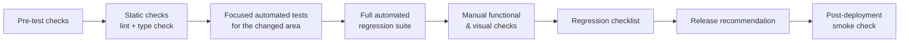

# Test Plan

A reusable plan for validating a Timbra release or a meaningful change. The [Test Strategy](test-strategy.md) explains *how and why* testing is done. This plan explains **what to execute, in which order, and when the result is good enough to release.**

## 1. When to use this plan

Run it, in full or scoped to the affected areas, before:

- a feature release
- a change to booking logic (availability, ranking, durations, collisions)
- a change to the admin calendars (Day / Week / Agenda)
- an authentication or security change
- a database change that affects bookings or schedules
- a production deployment that changes behaviour

Not every change needs the full plan. A documentation-only change or a copy tweak doesn't. **Scope to what actually changed.**

## 2. Validation scope template

Filled in at the start of each cycle:

```
Release / change:       <short description>
Version / reference:    <release identifier>
Date:                   <YYYY-MM-DD>
Tester:                 <name>
Environment:            local | production (smoke only)
Affected areas:         <from §3>
Affected requirements:  <REQ IDs>
Affected risks:         <RISK IDs>
Database changes:       <none | description>
Known limitations:      <anything from §12 relevant to this change>
```

## 3. In-scope areas

Booking engine · Magnetic ranking · Timezone/DST · Schedules and exceptions · Customer booking flow · Cancellation · Admin authentication/authorization · Admin bookings and manual booking · Day / Week / Agenda views · Treatment management · Notification pipeline · Database integrity and concurrency · Security controls · Localization (sv/en)

## 4. Priority for this cycle

Priority means **execution order**, not severity. It depends on what the release touches.

| Priority | Validate |
|---|---|
| **P0: must validate if the change could touch it** | Double-booking prevention · Past-time protection (customer *and* admin) · Timezone/DST correctness · Admin authorization · Secret and token protection · Booking creation integrity (atomicity, concurrency) |
| **P1: high** | Customer booking flow · Admin calendars · Cancellation · Schedules and exceptions · Notification job behaviour |
| **P2: supporting** | Responsive polish · Localization · Visual polish |

## 5. Execution order



### Pre-test checks
- The change and its scope are understood.
- The affected requirements and risks are identified.
- The environment is available and its database structure is up to date.
- The **test data state is known**, for example whether demo data is loaded locally. This matters because of a known local test-data interaction (see [case study 5](regression-case-studies.md#case-study-5--test-environment-finding-demo-data-vs-integration-test-data)).
- **No reset or reseed of production data is planned.** Production data is always preserved.
- Any credentials needed (such as an admin sign-in) are entered privately and never written into test records.

### Static checks
Lint, type check and the automated test suite. All three are independent, so a change can pass one and fail another.

### Automated tests
1. **Focused first.** Run the tests for the area that changed (booking engine, time handling, authentication, calendars, notifications, database layer).
2. **Then the full suite**, before anything that changes behaviour ships.
3. **Compare failures with known, documented environment conditions.** If the pattern differs from the known one, investigate. Never assume "probably the same issue".

## 6. Manual validation

### Customer flow (using demo data only, never real customer data)
1. Open the booking flow in Swedish, then in English.
2. Choose a treatment and a date.
3. Check the **recommended time**, and check that other valid times are still visible and selectable.
4. Choose a time and enter customer details. Try invalid details as well (negative testing).
5. Create the booking and check that the confirmation page shows only the expected summary.
6. Open the manage link and cancel (when cancellation is in scope).
7. Confirm that a past or already-taken time can't be booked.

### Admin flow
- Only an authorized account can sign in.
- Booking list and detail views, and status changes, work.
- **Manual booking: the admin can skip minimum notice but can never book a past time.** Always verify both together, because they were once coupled by mistake (see [case study 2](regression-case-studies.md#case-study-2--admin-notice-bypass-also-bypassed-the-past-time-safety-floor)).
- Treatment and schedule management work.

### Calendars
- **Day:** previous / today / next; proportional block heights; short bookings stay readable.
- **Week:** correct Monday–Sunday week; navigation across a DST week; aligned time axis across days; horizontal scrolling on narrow screens.
- **Agenda:** shows the same bookings as Day view. *Agenda has no dedicated recorded visual check yet, so don't assume it has the same coverage as Day and Week.*

### Responsive checks
Desktop (~1440 px), tablet (~768 px) and mobile (~375 px). Check clipping, overflow, scrolling, readability and navigation.
*This is a multi-viewport check in one browser. It isn't cross-browser testing, and isn't described as such.*

### Notifications
Validate **pipeline behaviour** (jobs created, none for admin bookings, retries, content in both languages). Local messages can be inspected in a local email catcher. **Don't treat real production delivery as validated. It isn't live yet.**

## 7. Regression checklist

For every P0/P1 change, tick each item that applies:

```
[ ] Customers cannot book a past time
[ ] Admin cannot book a past time
[ ] Customer minimum notice still enforced
[ ] Admin notice bypass still works — and still respects the past-time floor
[ ] Double-booking protection intact
[ ] Cancelling a booking frees the time again
[ ] Admin sign-in and authorization still enforced
[ ] Day / Week / Agenda view selection intact
[ ] Week navigation still correct across DST
[ ] No secret or private token exposed to the browser
[ ] Production data not reset or reseeded
```

Each item traces back to a real past incident or a Critical/High risk.

## 8. Defect handling during execution

1. **Classify first:** product defect, regression, test defect, test-environment issue, or known limitation.
2. Reproduce it.
3. Capture evidence: exact steps, output and environment state.
4. Link it to the affected requirement and risk.
5. Fix it, if it's in scope.
6. Add a regression test at the lowest reliable layer.
7. Re-run the focused tests, then the broader regression.
8. Document significant incidents.

## 9. Exit criteria

- Relevant automated tests have run, and every failure is **explained**.
- No unresolved Critical defect in the validated scope.
- Any High defect has been explicitly reviewed before release.
- The required manual checks are done, with evidence.
- Known environment failures are clearly separated from genuine regressions.
- Relevant coverage gaps are documented.

## 10. Release recommendation

Each cycle ends with one QA recommendation:

| Outcome | Meaning |
|---|---|
| **GO** | Required scope validated; no unacceptable open defect |
| **GO WITH KNOWN LIMITATIONS** | Remaining issues understood, documented and explicitly accepted |
| **NO-GO** | An unresolved defect presents an unacceptable booking, security or data-integrity risk, or the environment can't give reliable evidence for a Critical area |

## 11. Post-deployment smoke check

A short check straight after a production deployment:
- The site loads, and the booking pages load in both languages.
- The admin sign-in page loads, and sign-in works.
- The Day, Week and Agenda views open, and existing bookings are visible.
- The specific changed feature works.
- **Existing data is still present.**

No unnecessary production bookings are created, and no notifications are dispatched as part of a smoke check.

## 12. Known limitations affecting this plan

No browser E2E automation · No rendered-component tests · No cross-browser or accessibility automation · No staging environment · No CI gate · Local test-data isolation issue · Real notification delivery not live.

See [Known limitations & future QA](known-limitations-and-future-qa.md).

## 13. Test evidence

For each execution, record the date, version, environment and tester; the automated results (and whether any failures matched known conditions); which manual checks were executed, with PASS/FAIL and screenshots where useful; defects found and how they were classified; and the final recommendation.

Records are kept as plain Markdown alongside the project. No test-management tool is used.
