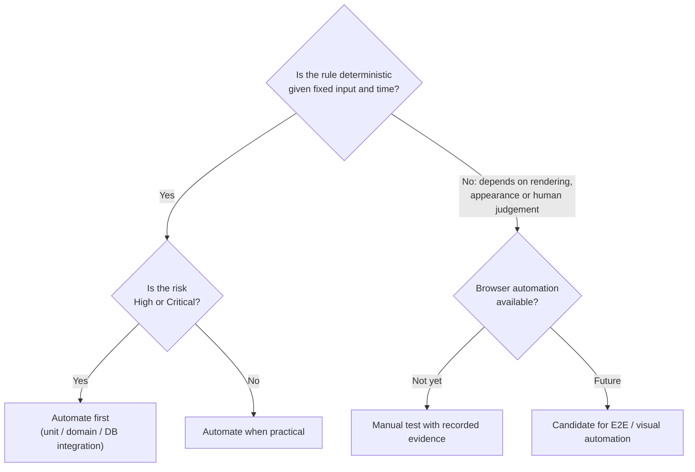

# Test Types and Approach

What kinds of testing Timbra uses, what each one proves, and what it **can't** prove. Only test types that were actually used are listed as used.

## 1. Vocabulary used in this portfolio

| Term | Meaning here |
|---|---|
| **Test strategy** | The overall approach and why it was chosen ([Test Strategy](test-strategy.md)) |
| **Test plan** | What to execute for a specific release, and when it is good enough ([Test Plan](test-plan.md)) |
| **Test scenario** | A behaviour worth verifying, in plain language: *"A customer cannot cancel after the cutoff."* |
| **Test case** | A scenario made precise: preconditions, data, steps, expected result |
| **Automated test** | One executable way to run a test case |
| **Manual test** | A person running a test case, typically in a browser |
| **Regression test** | A test that exists *because* something once broke. It describes **why** the test exists, not **how** it runs. |

## 2. Test types used in Timbra

### Automated

| Type | What it proves | Example in Timbra |
|---|---|---|
| **Unit** | A small piece of logic gives the exact expected output for fixed input | Booking duration maths: preparation + treatment + buffer gives the four timestamps |
| **Domain / business-logic** | A *business rule* holds, not just a utility | Ranking prefers fewer fragments; a schedule exception replaces (not merges with) weekly hours; cancellation cutoff policy |
| **Integration (real database)** | Code and a real PostgreSQL database work together as intended | Creating a booking saves the customer, booking and notification jobs together, or nothing at all |
| **Database constraint** | The database *itself* refuses invalid data | An overlapping booking is rejected by the database, even if the application forgot to check |
| **Concurrency** | Simultaneous requests resolve safely | Two simultaneous requests for the same time: exactly one succeeds. A cancellation racing an admin status change: no corrupted state. |
| **Timezone / DST** | Local ↔ absolute time is correct at real transition dates | Non-existent and ambiguous local times are rejected; cutoffs use real elapsed hours |
| **Authentication / authorization** | "Who is signed in?" and "Are they allowed?" are answered separately and correctly | Signed-in but not allow-listed → treated as not signed in; missing configuration → nobody is authorized |
| **View-model / layout logic** | The *numbers and decisions* behind the calendar UI are correct | Block position and height proportional to duration; content level chosen for short bookings |
| **Static regression / security guards** | The *source code* never contains a forbidden pattern | No secret-handling code in browser code; every admin action performs an authorization check |

**What view-model tests can't prove:** that the rendered screen actually looks right. They never draw anything on screen. That is covered by manual visual testing.

**What static guards can't prove:** runtime behaviour. They inspect how the code is written, not how it runs. Their strength is that they catch the dangerous pattern **in any file**, including files nobody thought to test.

### Manual

| Type | What it covers | Evidence status |
|---|---|---|
| **Manual functional** | Full customer and admin journeys in a real browser | Customer booking flow verified end-to-end; admin flows exercised during development |
| **Manual visual / responsive** | Actual rendered appearance at ~1440 / ~768 / ~375 px | **Recorded** for the Day and Week calendar views. **Not yet recorded** separately for the Agenda view (open gap). |
| **Smoke** | Fast "is it fundamentally working?" check after deployment | Used as a practice after deployments |
| **Stakeholder walkthrough / usability (planned)** | Whether the product fits the owner's real workflow | **Planned, not yet conducted.** See [Planned stakeholder usability session](stakeholder-usability-session.md). |

### Regression testing

Regression testing appears in two forms:

1. **Regression tests.** These are automated tests added together with a defect fix. See the four resolved [case studies](regression-case-studies.md).
2. **Regression passes.** These run the full automated suite plus the [regression checklist](test-plan.md#7-regression-checklist) before a release.

### Test design techniques

| Technique | Where it's used |
|---|---|
| **Boundary value analysis** | Cancellation cutoff (before / exactly at / after), minimum notice (one minute short / exact), back-to-back bookings, DST transition instants |
| **Equivalence partitioning** | Valid vs invalid email/phone/name inputs; open day vs closed day vs split day; customer vs admin caller |
| **Negative testing** | Invalid customer data, invalid status transitions, unknown and malformed manage links, unauthorized admin access |
| **State-transition testing** | Booking lifecycle: only *Confirmed* can move; *Completed / No-show / Cancelled* are final |
| **Risk-based prioritisation** | Test depth follows the [Risk Register](risk-register.md) |
| **Paired (A/B) control tests** | An admin-created booking creates zero notifications, proven next to an otherwise identical customer booking that *does* create them, so "zero" is shown not to be an accident |

Examples: [Boundary & negative testing](boundary-and-negative-testing.md).

## 3. Manual vs automated: how the split was decided

| Area | Automated | Manual |
|---|---|---|
| Eligibility and ranking rules | ✔ | Checked in the browser that the recommendation shows correctly |
| Time zones and DST | ✔ | Not practical manually |
| Double booking and concurrency | ✔ (real database) | — |
| Authorization rules | ✔ | Sign-in behaviour checked in the browser |
| Calendar layout *calculations* | ✔ | — |
| Calendar *appearance* and readability | — | ✔ |
| Full customer journey in a browser | — (gap) | ✔ |
| Responsive behaviour | — (gap) | ✔ Day and Week recorded; Agenda open |

## 4. Test types not used yet

These are listed openly so they aren't mistaken for existing coverage:

- **Browser end-to-end automation** (such as Playwright). Not implemented.
- **Rendered UI component tests.** Not implemented.
- **Accessibility automation.** Not implemented.
- **Cross-browser automation.** Not implemented.
- **Performance / load testing.** Not performed.
- **Formal penetration testing.** Not performed.

None of these gaps means the application is known to be broken in those areas. It means there is **no repeatable proof either way yet**. See [Known limitations & future QA](known-limitations-and-future-qa.md).

## 5. Test environment dependency

- **Most automated tests need no infrastructure** and run in under a second.
- **Database integration tests need a local PostgreSQL instance** (Docker-based). They skip cleanly when it isn't available.
- Local demo data and integration tests currently share one local database. That interaction is documented in [case study 5](regression-case-studies.md#case-study-5--test-environment-finding-demo-data-vs-integration-test-data).
