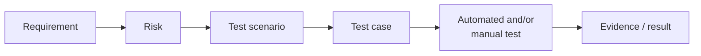

# Traceability Examples

Traceability answers one question: **which tests protect which requirement, and where are the gaps?** In Timbra, every test case traces back to a requirement and a risk.

| Link | Question it answers |
|---|---|
| Requirement → Risk | *What goes wrong for the business if this breaks?* |
| Risk → Scenario | *What situation would expose that failure?* |
| Scenario → Test case | *What exact data, steps and expected result prove it?* |
| Test case → Test | *Can a machine check this every time, or does a person need to look?* |
| Test → Evidence | *What shows it was actually checked, and what is still a gap?* |

**Coverage vocabulary:** *Covered* (automated, no meaningful gap) · *Partially covered* (the logic is automated, but part of the flow isn't) · *Manual only* · *Gap* (no automated or recorded manual evidence) · *Out of scope* (not a V1 requirement).

---

## Example 1: No double bookings

| Step | Content |
|---|---|
| **Requirement** | REQ-BK-004: the system must never store two active bookings whose occupied intervals overlap |
| **Risk** | RISK-001 Double booking (Critical). Two customers arrive for the same slot; trust and revenue are lost. |
| **Scenarios** | (a) The candidate overlaps only through preparation/buffer time · (b) a time is taken between page load and submit · (c) two customers confirm the same time at the same moment · (d) the application check is bypassed entirely |
| **Test cases** | (a) [BK-002](test-cases/booking-engine.md#bk-002-collisions-use-the-occupied-interval-not-the-customer-visible-interval) · (b) server re-check (partially covered) · (c) [BK-008](test-cases/booking-engine.md#bk-008-simultaneous-booking-requests-exactly-one-wins) · (d) [BK-006](test-cases/booking-engine.md#bk-006-the-database-rejects-an-overlapping-booking) |
| **Tests** | Domain-logic test (a); availability recalculation integration test (b); real-database concurrency test (c); real-database constraint test (d) |
| **Evidence** | Automated tests in the suite for (a), (c), (d). The re-check request handler in (b) has no dedicated test. |
| **Coverage** | **Covered.** The final protection is the database itself, and it is tested directly. |

## Example 2: The admin can skip minimum notice, but never book the past

| Step | Content |
|---|---|
| **Requirement** | REQ-ADM-004: admin manual bookings skip the minimum-notice policy **only**; the past-time floor always applies |
| **Risk** | RISK-003 Booking offered or created in the past (High) |
| **Scenarios** | (a) The admin books a same-day customer inside the notice window · (b) the admin looks at slots earlier today · (c) a slot's customer start is "now", but its preparation has already begun |
| **Test cases** | (a) [ADM-006](test-cases/booking-engine.md#adm-006-admin-manual-booking-may-skip-minimum-notice) · (b), (c) [ADM-007](test-cases/booking-engine.md#adm-007-the-admin-still-cannot-book-a-past-time) |
| **Tests** | Unit tests of the past-time filter; integration tests of availability for admin *and* customer callers |
| **Evidence** | Automated. These tests were **added as regression protection** after a real defect ([case study 2](regression-case-studies.md#case-study-2--admin-notice-bypass-also-bypassed-the-past-time-safety-floor)). |
| **Coverage** | **Covered** at the engine level. The admin form's own handler has no dedicated test (a documented gap). |

## Example 3: The cancellation cutoff is exact, even across DST

| Step | Content |
|---|---|
| **Requirement** | REQ-CAN-003 / REQ-TZ-005: customers can cancel strictly before the cutoff, measured in real elapsed time |
| **Risk** | A valid cancellation is rejected, or a late one accepted (High); a wrong result around a DST change (RISK-002, Critical) |
| **Scenarios** | One minute before · exactly at · after the cutoff · a cutoff window that crosses a DST change |
| **Test cases** | [CAN-003](test-cases/cancellation.md#can-003-cancellation-allowed-strictly-before-the-cutoff), [CAN-004](test-cases/cancellation.md#can-004-cancellation-rejected-at-the-exact-cutoff-instant), [CAN-005](test-cases/cancellation.md#can-005-cancellation-rejected-after-the-cutoff), [TZ-007](test-cases/timezone-dst.md#tz-007-the-cancellation-cutoff-stays-correct-across-a-dst-change) |
| **Tests** | Pure boundary tests with an injected current time; real-database cancellation tests |
| **Evidence** | Automated |
| **Coverage** | **Covered** |

## Example 4: The recommendation must not restrict choice

| Step | Content |
|---|---|
| **Requirement** | REQ-MAG-004 / REQ-MAG-005: ranking only reorders; the recommended highlight never hides valid times |
| **Risk** | Customers lose choice and trust; the core product principle is broken (Critical) |
| **Scenarios** | Ranking a set of valid slots; displaying ranked slots with a recommendation |
| **Test cases** | [MAG-005](test-cases/magnetic-ranking.md#mag-005-ranking-never-changes-which-slots-are-eligible), [MAG-004](test-cases/magnetic-ranking.md#mag-004-the-recommendation-never-hides-other-valid-times) |
| **Tests** | Invariant test (same set in, same set out); presentation-rule unit test; manual browser check as part of the customer flow |
| **Coverage** | **Covered** (logic); the rendered display is checked manually |

---

## Summary matrix (excerpt)

| Requirement | Risk | Cases | Automated | Manual | Coverage |
|---|---|---|---|---|---|
| REQ-BK-001 Four-timestamp model | RISK-001 | BK-001 | ✔ | — | Covered |
| REQ-BK-004 Database rejects overlaps | RISK-001 | BK-006 | ✔ | — | Covered |
| REQ-BK-006 Concurrent requests: one winner | RISK-001 | BK-008 | ✔ | — | Covered |
| REQ-BK-008 Customer minimum notice | — | BK-010 | ✔ | — | Covered |
| REQ-SCH-002 Exception replaces weekly hours | — | SCH-002 | ✔ | — | Covered |
| REQ-ADM-004 Admin bypass limited to notice | RISK-003 | ADM-006, ADM-007 | ✔ | — | Covered |
| REQ-MAG-004 Ranking never changes eligibility | — | MAG-005 | ✔ | — | Covered |
| REQ-TZ-002/003 Non-existent / ambiguous times rejected | RISK-002 | TZ-002, TZ-003 | ✔ | — | Covered |
| REQ-CAN-003 Exact cutoff | — | CAN-003/004/005 | ✔ | — | Covered |
| REQ-AUTH-001…005 Admin protection | RISK-004 | AUTH-001/002/004/006 | ✔ | — | Covered |
| REQ-CUS-004 End-to-end customer booking | RISK-008 | (full catalogue) | Logic and data ✔ | ✔ recorded | **Partially covered**: no browser automation |
| REQ-WV Week view renders usably at 3 widths | RISK-007 | (full catalogue) | Layout logic ✔ | ✔ recorded | **Manual only** |
| REQ-AG Agenda renders usably at 3 widths | RISK-007 | (full catalogue) | — | Not recorded | **Gap** |

The last three rows are included deliberately. A traceability matrix that shows only green rows isn't a useful QA tool.
